<!--
  ClaimPilot README.
  Brand assets in docs/assets/: claimpilot-lockup.png (light backgrounds),
  claimpilot-lockup-dark.png (dark backgrounds - auto-selected below),
  claimpilot-logo.png (square icon), social-preview.png (repo social card).
-->

<div align="center">

<picture>
  <source media="(prefers-color-scheme: dark)" srcset="docs/assets/claimpilot-lockup-dark.png">
  
</picture>

<h3>Every dollar cited. Every conclusion traceable. Hallucinations fail closed.</h3>

<p>
An evidence-grounded copilot for freight-claim negotiation. A claim folder goes in -
emails, ERP/TMS records, PDFs, an image-only scan, photos, the carrier contract,
historical settlements - and a decision-ready <b>Negotiation Position Brief</b> comes
out, where every figure carries a verbatim, mechanically verified citation, every
computed number carries its formula, and AI-written prose that cannot prove its numbers
is withheld rather than shipped.
</p>

<!-- Badges: every value below is measured by this repo's own eval suite. -->

[](LICENSE)
[](pyproject.toml)
[](evals/eval_report.md)
[-brightgreen.svg)](evals/eval_report.md)
[](tests)
[](#grounding-two-mechanical-gates)

[](#reliability-by-construction)
[](#retrieval-datum-and-why-it-earned-the-slot)
[](#reliability-by-construction)
[](ASSUMPTIONS.md)

<p>
  <a href="#quickstart"><b>Quickstart</b></a> &nbsp;·&nbsp;
  <a href="#how-it-works"><b>Architecture</b></a> &nbsp;·&nbsp;
  <a href="#grounding-two-mechanical-gates"><b>Grounding</b></a> &nbsp;·&nbsp;
  <a href="#retrieval-datum-and-why-it-earned-the-slot"><b>Retrieval</b></a> &nbsp;·&nbsp;
  <a href="#evaluation"><b>Evaluation</b></a> &nbsp;·&nbsp;
  <a href="#the-case-it-decides"><b>The case</b></a> &nbsp;·&nbsp;
  <a href="#design-decisions-and-trade-offs"><b>Trade-offs</b></a>
</p>


</div>

---

> [!IMPORTANT]
> **About this repo.** ClaimPilot was built for a senior-AI-engineer technical exercise
> around one synthetic freight claim (**FCL-2026-0147**, Northstar Retail Equipment vs
> BlueLine Freight Systems). All companies, people and records are fictional. The brief
> shown above is real output from a real end-to-end run; with the committed response
> cache, the entire pipeline replays **offline, deterministically and for free**
> (`--provider replay`).

## Contents

- [Why ClaimPilot](#why-claimpilot)
- [What it produces](#what-it-produces)
- [Quickstart](#quickstart)
- [How it works](#how-it-works)
- [Grounding: two mechanical gates](#grounding-two-mechanical-gates)
- [Reliability by construction](#reliability-by-construction)
- [Retrieval: datum, and why it earned the slot](#retrieval-datum-and-why-it-earned-the-slot)
- [Evaluation](#evaluation)
- [The case it decides](#the-case-it-decides)
- [Configuration](#configuration)
- [Project layout](#project-layout)
- [Design decisions and trade-offs](#design-decisions-and-trade-offs)
- [Taking it to production](#taking-it-to-production)
- [Assumptions](#assumptions)
- [Acknowledgements](#acknowledgements)

## Why ClaimPilot

A freight-claims specialist deciding the next negotiation move has to re-read a
six-message email thread, five PDFs (one an image-only scan), TMS and ERP records, two
warehouse photos, the carrier's master agreement, and a table of past settlements - then
take a defensible money position. That is hours of assembly per claim, and it is exactly
the kind of multi-source reading LLMs are brilliant at.

It is also exactly where a single overloaded generation is dangerous. Ask a model to
"write the response to this claim" and four different jobs - reading the language, doing
the arithmetic, interpreting the contract, and exercising judgment - all hide inside one
completion, and so do its hallucinations.

```python
# The overloaded call. Reading, math, contract logic and judgment all
# hide inside one generation - and so do its hallucinations.
reply = llm("Write a response to this freight claim: " + folder)

# ClaimPilot. The LLM only reads language. Facts carry verbatim quotes that a
# gate re-checks against the source. Everything with a right answer is computed,
# not generated. Output that cannot prove its numbers does not ship.
case = run_pipeline(cfg)
case["position_numbers"]["position.recommended_counter"]
# {'value': '11920.00',
#  'formula': 'core_high $10,070.00 + goodwill_high $1,850.00',
#  'id': 'F-217'}   <- click through to inputs, quotes, and source files
```

ClaimPilot's stance: **grounding is enforced by machinery, not requested by prompt.**
The specialist stays the decision-maker; nothing is auto-sent.

<div align="right"><a href="#contents">back to top</a></div>

## What it produces

One command turns the claim folder into four artifacts:

| Output | What it is |
|---|---|
| `out/position_brief.html` | The deliverable - a self-contained, light/dark, printable brief: entitlement table, discrepancy panel, evidence gaps, quoted contract terms, comparables, the recommended counter with its arithmetic, a draft reply, a retrieval-audit table, QA panel, and the full fact ledger |
| `out/case_file.json` | The audit artifact - all 227 facts with provenance, formulas, confidences and verification state |
| `out/draft_reply.txt` | The guarded draft email, ready for specialist review |
| `out/position_brief.md` | Terminal/PR-friendly mirror of the brief |

Plus a grounded Q&A mode (`claimpilot ask`) that answers questions about the claim with
verbatim quotes - or says honestly that the folder cannot answer them.

<div align="right"><a href="#contents">back to top</a></div>

## Quickstart

```bash
git clone <this-repo> && cd freight-claim-copilot
# the claim folder (the exercise pack) sits one directory up: --pack ..

# 1. Build the brief (auto-detects LLM provider and retrieval backend)
python3 -m claimpilot run --pack ..

# 2. Open the deliverable
open out/position_brief.html

# 3. Ask the claim folder questions, with citations
python3 -m claimpilot ask "why is the markdown excluded?"

# 4. Prove it behaves: golden eval + ablation, retrieval benchmark, unit tests
python3 -m claimpilot eval  --pack ..
python3 -m claimpilot bench --pack ..
python3 -m unittest discover -s tests
```

**Dependencies:** Python 3.9+, `pypdf` (and optional `openpyxl` for the xlsx
cross-check). Everything else is standard library - no LangChain, no SDK, no vector-DB
client. **LLM access, in preference order:** `ANTHROPIC_API_KEY` (direct API),
a logged-in Claude CLI (`claude -p`, headless), or `--provider replay` for the
committed cache (offline, free, deterministic). **datum retrieval is optional:** without
it, the stdlib FTS5 backend engages with a loud warning (see
[Retrieval](#retrieval-datum-and-why-it-earned-the-slot)).

<details>
<summary><b>Full CLI reference</b></summary>

<br/>

```text
claimpilot run   --pack DIR [--out DIR] [--provider anthropic|claude-cli|replay]
                 [--model ID] [--retrieval auto|datum|fts5]
                 [--ablate SOURCE_ID]... [--no-vision-verify]
    Build the Negotiation Position Brief end to end.
    --ablate hides a source for the run (the failure-handling demo):
        claimpilot run --pack .. --ablate inspection_report --out out/ablation

claimpilot ask "QUESTION" [-k N] [--retrieval ...]
    Grounded Q&A over the claim folder. Answers cite sources in brackets;
    an unanswerable question gets an honest refusal, not a guess.

claimpilot eval  --pack DIR
    Golden-set evaluation + the ablation run. Writes evals/eval_report.md.

claimpilot bench --pack DIR
    Retrieval head-to-head (datum default / datum calibrated / FTS5) on the
    gold query set. Writes evals/retrieval_bench.md.
```

</details>

<div align="right"><a href="#contents">back to top</a></div>

## How it works

```mermaid
flowchart LR
    subgraph folder["Claim folder - 15 sources"]
        s1["email thread · JSON/CSV/XLSX<br/>text PDFs · image-only scan<br/>photos · carrier MSA · history"]
    end
    s1 --> A["<b>1 INGEST</b><br/>deterministic parsers<br/>sha256 · trust tiers"]
    A --> B["<b>2 EXTRACT</b><br/>LLM, schema-forced,<br/>verbatim quote per field<br/>vision: transcript → fields → re-verify"]
    B --> C["<b>3 GROUND</b><br/>quote must exist in source<br/>else the fact is quarantined"]
    C --> D["<b>4 RECONCILE</b><br/>14 pure-Python rules<br/>counts · money · dates · docs<br/>source-authority rulings"]
    D --> E["<b>5 ENTITLE</b><br/>datum retrieves MSA clauses<br/>LLM reads params (quoted)<br/>deterministic calculator"]
    E --> F["<b>6 BENCHMARK</b><br/>similarity + dispute-pattern<br/>over 30 past claims"]
    F --> G["<b>7 COMPOSE</b><br/>LLM writes brief + reply<br/>NumberGuard + ref check<br/>bounded repair · fails CLOSED"]
    G --> H["brief.html<br/>case_file.json<br/>draft_reply.txt"]
```



The division of labor is the design:

| Stage | Who does it | Why |
|---|---|---|
| Parsing, checksums, trust tiers | Python | deterministic, testable |
| Reading language into typed facts | **LLM** (schema-forced, quoted) | what LLMs are for |
| Verifying every quote against its source | Python | trust nothing unverified |
| Cross-source reconciliation, authority rulings | Python (14 rules) | conflicts have right answers |
| Finding the governing contract clauses | **datum** retrieval | ranking is a retrieval problem |
| Reading clause parameters ($50/lb, 9 months...) | **LLM** (quoted) | language again |
| Liability caps, deadlines, the negotiation math | Python | money math is not generative |
| Historical comparables + cohort stats | Python | arithmetic over a table |
| Writing the brief and the draft reply | **LLM** | prose - behind two gates |

Every computed number lands in the **fact ledger** with its formula and input fact ids,
so any figure in the brief can be walked back to source documents in two clicks.

<div align="right"><a href="#contents">back to top</a></div>

## Grounding: two mechanical gates

Three registers are kept apart *structurally*, not stylistically:

| Register | Meaning | Example |
|---|---|---|
| `EXTRACTED` | read from a source; must carry a verified verbatim quote | POD records 58 cartons received |
| `ASSERTED` | a party's claim - real as a statement, unestablished as a fact | the shipper's $18,000 markdown figure |
| `DERIVED` | computed here; carries formula + input fact ids | shortage = 60 − 58 cartons → 8 units |

**Gate 1 - the quote gate.** Every LLM-extracted field must include a verbatim quote;
the gate re-checks that the quote actually occurs in its source (normalized, with a
bounded fuzzy fallback for PDF artifacts). A fact whose quotes all fail is
**quarantined**: visible in the audit, excluded from all downstream reasoning. Current
run: **207/207 quotes verified, all exact-match, zero quarantined.**

**Gate 2 - NumberGuard.** The brief and draft reply may only contain numbers, dates and
times derivable from the verified ledger. The *same tokenizer* builds the allow-list
from fact values and scans the generated text, so the two sides cannot drift apart.
Violations are fed back for a bounded repair; if the output still fails, the run
**fails closed** - deterministic sections render, AI prose is withheld with the
violation list attached. Hallucination becomes a *detected event*, not a hoped-away risk.

Image-only sources get a third check: vision produces a full transcript (which becomes
the citable text), fields quote the transcript, and an independent second pass re-reads
the image to confirm the key values; OCR-derived facts carry reduced confidence and are
cross-checked against structured records (inspection counts vs the signed POD).

<div align="center">

</div>

<details>
<summary><b>What a fact actually looks like</b> (from <code>out/case_file.json</code>)</summary>

<br/>

```json
{
  "fact_id": "F-089",
  "key": "pod.received_cartons",
  "value": 58,
  "kind": "EXTRACTED",
  "method": "LLM",
  "citations": [{
    "source_id": "proof_of_delivery",
    "locator": "page:1",
    "quote": "58 cartons",
    "verified": true,
    "match_ratio": 1.0
  }],
  "confidence": 1.0
}
```

And a derived one - every number in the negotiation is auditable like this:

```json
{
  "fact_id": "F-217",
  "key": "position.recommended_counter",
  "value": "11920.00",
  "kind": "DERIVED",
  "method": "COMPUTED",
  "formula": "core_high $10,070.00 + goodwill_high $1,850.00"
}
```

</details>

<div align="right"><a href="#contents">back to top</a></div>

## Reliability by construction

- **Deterministic replay.** Every LLM call is temperature-0, schema-validated and cached
  content-addressed (`.cache/llm/`). Same inputs → byte-identical run, zero network,
  zero cost. Evals and CI run on replay.
- **Bounded repair loops.** Schema violations and guard violations are fed back with the
  exact errors, at most twice; then the stage fails explicitly (extraction) or closed
  (composition). Both repair paths fired - and recovered - during development.
- **Graceful degradation, proven.** A missing or unreadable source never aborts the run:
  rules skip with notes, gaps are raised, entitlements downgrade. The eval suite deletes
  the scanned inspection report and asserts the degradation contract
  (see [Evaluation](#evaluation)).
- **Total auditability.** Per-source sha256, versioned prompts, per-call cost/latency in
  the run log, and retrieval plan ids in the brief itself.

<div align="right"><a href="#contents">back to top</a></div>

## Retrieval: datum, and why it earned the slot

Contract-clause lookup and `ask` run on a small `Retriever` protocol with two
conformant backends over identical chunks:

- **[datum](https://github.com/COLONAYUSH/Datum)** *(primary)* - a compiled-query
  retrieval substrate: hybrid grep + BM25 + ANN over Postgres/pgvector, fused with
  weighted RRF and reranked by a cross-encoder. It runs out-of-process under its own
  Python 3.12 venv via a JSON-lines bridge - which is also how it would deploy for real
  (its native surface is a service/MCP server).
- **SQLite FTS5** *(fallback)* - stdlib BM25, zero infrastructure. Selection is loud,
  never silent: `auto` prefers datum and logs exactly what was missing when it falls
  back.

datum is not here as a nicer search box. Four capabilities the baseline structurally
lacks are load-bearing in a claims/compliance domain:

| Capability | Where ClaimPilot uses it |
|---|---|
| **Typed abstention** (`insufficient_evidence`) | a clause topic with no supporting text is reported as exactly that - the system will not cite the nearest-sounding clause |
| **Span/section provenance on every hit** | retrieval hits carry `source > section` paths that feed citations directly |
| **Explainable, replayable plans** (`plan_id` → `explain`/`replay`) | every clause lookup's plan id lands in the brief's retrieval-audit table; the evidence for a decision can be reproduced later |
| **Fail-closed namespace isolation** | one namespace per shipper/tenant, resolved before any operator runs |

Measured on the 21-query gold set (verbatim / paraphrase / semantic / entity /
cross-document / deliberately unanswerable - `evals/retrieval_bench.md`):

| backend | hit@1 | hit@3 | MRR@5 | paraphrase hit@1 | refusals on unanswerable |
|---|---|---|---|---|---|
| SQLite FTS5 | 72% | 89% | 0.81 | 33% | 0/3 |
| datum (default floor) | **89%** | **94%** | **0.93** | **100%** | 0/3 |
| datum (calibrated floor 0.50) | 83% | 89% | 0.87 | **100%** | **2/3** |

Two findings worth naming honestly:

1. **The ranking gap is where theory predicts** - paraphrase and cross-document
   queries, where lexical overlap fails and dense+rerank does not.
2. **Abstention is a tunable capability, not a free lunch.** datum's default
   sufficiency floor refuses nothing on this corpus, so the floor was calibrated on the
   gold set (`evals/abstention_sweep.py`; full precision/recall curve in
   `evals/abstention_sweep.md`): at 0.50 it refuses 2 of 3 unanswerable probes at the
   cost of one answerable abstention. That floor ships as the default. FTS5 cannot
   express refusal at all - every unanswerable query confidently returns a
   wrong-but-plausible chunk.

> [!NOTE]
> **An integration lesson that matters at scale:** datum ranks at sub-section *span*
> precision. ClaimPilot maps every hit back to its full canonical section before the
> LLM reads it - span-precise ranking, complete-clause reading. Found the hard way:
> §3's inspection-costs sentence kept losing its retrieval slot to §3's opening
> sentences under a naive per-section dedup, and the terms extractor "correctly"
> reported the topic as absent.

<div align="right"><a href="#contents">back to top</a></div>

## Evaluation

Three layers, all runnable from the CLI, results committed:

| Layer | What it checks | Result |
|---|---|---|
| **Unit tests** (`tests/`) | reconciliation rules, cap math, date math, NumberGuard, quote verification, schema validator, benchmark scoring | **33/33** |
| **Golden-set eval** (`evals/eval_report.md`) | 72 hand-labeled facts across every extraction path (deterministic / LLM / vision), 6 planted discrepancies, 4 evidence gaps, 7 entitlement classifications and dollar bounds, comparables inclusion, citation validity ≥95%, guard cleanliness, **plus the ablation run** | **106/106** |
| **Retrieval bench + abstention sweep** (`evals/retrieval_bench.md`, `evals/abstention_sweep.md`) | hit@1/3, MRR@5, per-kind breakdown, false-answer rate on unanswerables, latency | table above |

**The ablation run** (`claimpilot eval` executes it automatically; artifacts in
`out/ablation/`): with the scanned inspection report deleted, the pipeline must
complete, downgrade the damage entitlement to NEEDS_INFO, raise a gap for the missing
report, and leak **no report-only detail** (report number, carton ids, inspector name)
into the brief or the ledger - degrade explicitly, invent nothing.

> [!TIP]
> These gates caught real defects during development: a fabricated quote quarantined by
> the quote gate, an ISO-timestamp tokenizer bug in NumberGuard caught by its own unit
> test, schema-shape drift in composition caught and repaired by the schema loop - and
> one error in the golden labels themselves (the $420/$300 figures legitimately survive
> the ablation via the email thread; the eval now asserts the right invariant). An eval
> harness that never fires is not evidence of quality.

<div align="right"><a href="#contents">back to top</a></div>

## The case it decides

Claim FCL-2026-0147: 240 barcode scanners ($102,000 invoice), delivered 4 days late
with 2 cartons missing and 5 damaged. Demand $29,920; carrier offer $7,225.

What the pipeline established - every item traceable in the brief:

- **The offer is exactly the undisputed floor.** 8 missing + 9 accepted damaged units
  × $425 = $7,225. The system derives this identity itself (`offer_equals_floor`).
- **EDI says 59, the signed POD says 58.** Surfaced as a HIGH conflict; resolved to the
  POD with the pack's data dictionary quoted as the authority - the disagreement is
  shown, not hidden.
- **Photos cover 2 of 5 damaged cartons** (the carrier's core dispute) - but the signed
  POD, the independent inspection (14 unsellable, foam present) and the driver's own
  note corroborate the disputed five.
- **The $18,000 markdown is contractually excluded** (§4, non-guaranteed Standard LTL;
  §1 says requested dates create no commitment) - so the brief *concedes it as the
  negotiation lever* while holding the evidence-backed components.
- **The freight charge ($1,850) is not owed but is a precedent-backed goodwill ask** -
  historical claim HC-2025-0094: "Promotion markdown denied; commercial freight refund
  approved."
- **The $50/lb liability cap never binds** (invoice value governs - checked per line),
  and both §5 notice deadlines were met (computed, not assumed).
- **Open items raised proactively:** salvage disposition for the unsellable units
  (§3 requires crediting it) and the repack-labor classification.

| | |
|---|---|
| Recommended counter | **$11,920.00** = fully documented case $10,070 + freight-scale goodwill $1,850 |
| Expected settlement band | $7,645 - $11,920 (vs $15,000 reserve) |
| Comparables | similar-evidence BlueLine damage claims settle at a **median 83.77%**; delay-only claims at **8.51%** |

<div align="right"><a href="#contents">back to top</a></div>

## Configuration

| Variable | Default | Meaning |
|---|---|---|
| `ANTHROPIC_API_KEY` | - | enables the direct-API provider (production path) |
| `ANTHROPIC_MODEL` | `claude-sonnet-5` | model id for either live provider |
| `DATUM_PYTHON` | auto-detected | python interpreter of the datum venv (3.11+) |
| `DATUM_PG_DSN` | `postgresql://localhost/datum_claims_fcc` | scratch Postgres DB for datum (pgvector required) |
| `CLAIMPILOT_ABSTAIN_FLOOR` | `0.50` (calibrated) | datum's evidence-sufficiency floor; empty string = datum's default |

<div align="right"><a href="#contents">back to top</a></div>

## Project layout

```text
freight-claim-copilot/
├── claimpilot/
│   ├── config.py          source manifest (trust tiers, data-dictionary semantics) + run config
│   ├── ingest.py          deterministic parsers: eml, JSON, CSV, XLSX, PDF, scan registration
│   ├── extract.py         stage 2: structured + LLM + vision extraction (quotes everywhere)
│   ├── grounding.py       the two gates: quote verification + NumberGuard
│   ├── reconcile.py       stage 4: the 14 cross-source rules and authority rulings
│   ├── retrieval.py       Retriever protocol · FTS5 backend · datum client · loud fallback
│   ├── datum_bridge.py    JSON-lines bridge, runs under datum's own venv
│   ├── entitlement.py     stage 5: clause retrieval → quoted params → deterministic calculator
│   ├── benchmark.py       stage 6: structural + dispute-pattern comparables, cohort stats
│   ├── position.py        stage 7: guarded composition (fails closed)
│   ├── llm.py             providers (anthropic · claude-cli · replay), cache, schema repair
│   ├── models.py          the fact ledger and domain types
│   ├── report.py          case_file.json · brief.md · brief.html renderers
│   ├── pipeline.py        orchestrator
│   └── cli.py             run · ask · eval · bench
├── evals/                 golden labels, eval runner, retrieval bench, abstention sweep + reports
├── tests/                 33 unit tests for the deterministic machinery
├── out/                   generated briefs (incl. the ablation variant)
├── ASSUMPTIONS.md         every judgment call, with its blast radius
└── .cache/llm/            content-addressed responses → offline deterministic replay
```

<div align="right"><a href="#contents">back to top</a></div>

## Design decisions and trade-offs

Stated plainly, because they were chosen, not overlooked:

- **Full-document extraction, retrieval for clauses.** These sources are single-page,
  so extraction feeds whole documents (better than RAG at this size); retrieval earns
  its keep on clause lookup, `ask`, and as the scaling path. A 30-page MSA changes the
  arithmetic, not the architecture - the `Retriever` protocol carries it unchanged.
- **OCR self-citation.** Quotes from scanned sources verify against the model's own
  transcript - inherent to any OCR pipeline. Mitigated by second-pass image
  verification, confidence discounts, and cross-checks against structured records;
  production adds an independent OCR engine for disagreement detection.
- **NumberGuard proves provenance, not usage.** A grounded number in a wrong sentence
  passes (as does a spelled-out "four"). The mandatory fact-references and the
  deterministic tables bound the damage; sentence-level entailment checking is the
  natural next layer.
- **The negotiation arithmetic is a policy, in the open.** Counter = documented
  supportable case + freight-scale goodwill; band = floor + inspection fee → counter.
  Historical settlement percentages are shown as context and never multiplied into the
  claim (the data dictionary forbids treating them as entitlements).
- **One claim, one run.** No queue, no database of record, no web UI - deliberate scope
  control; the interesting problems were grounding, conflict handling, and evaluation.

<div align="right"><a href="#contents">back to top</a></div>

## Taking it to production

What changes first, in order:

- [ ] Queue-driven intake: mailbox listener → claim-folder assembly → per-claim runs
- [ ] Direct Anthropic API through the enterprise gateway, per-stage token budgets
- [ ] Independent OCR engine (e.g. Textract) cross-validating vision transcripts
- [ ] datum as a shared retrieval service (its MCP surface) with per-tenant namespaces
      and real principals
- [ ] Reviewer UI: accept/override per entitlement line - overrides become training data
- [ ] Settlement-outcome feedback into the comparables stage (features already shaped)
- [ ] Claim-sentence entailment checking on top of NumberGuard
- [ ] Retention/PII policy on the ledger; monitoring on the QA metrics already emitted
      per run (citation validity, quarantine rate, guard violations, cost)

<div align="right"><a href="#contents">back to top</a></div>

## Assumptions

Every material judgment call - POD-over-EDI authority, the 15 lb unit weight and its
43% error margin before any conclusion changes, why the markdown is treated as an
assertion, what "photo coverage" counts, and ten more - lives in
[`ASSUMPTIONS.md`](ASSUMPTIONS.md) with reasoning and blast radius.

## Acknowledgements

ClaimPilot runs on [Claude](https://www.anthropic.com/claude) (`claude-sonnet-5`,
temperature 0) for language understanding and vision, [datum](https://github.com/COLONAYUSH/Datum)
for retrieval (with [PostgreSQL](https://www.postgresql.org/) +
[pgvector](https://github.com/pgvector/pgvector) underneath), and
[pypdf](https://github.com/py-pdf/pypdf) for text-layer extraction. The exercise
scenario and all records are synthetic.

## License

MIT. See [LICENSE](LICENSE).

<div align="center">
<br/>
<sub>Facts are cited and mechanically verified · computed figures carry their formulas ·
AI prose is labeled and guard-validated · a specialist decision remains required before
anything is sent.</sub>
</div>
