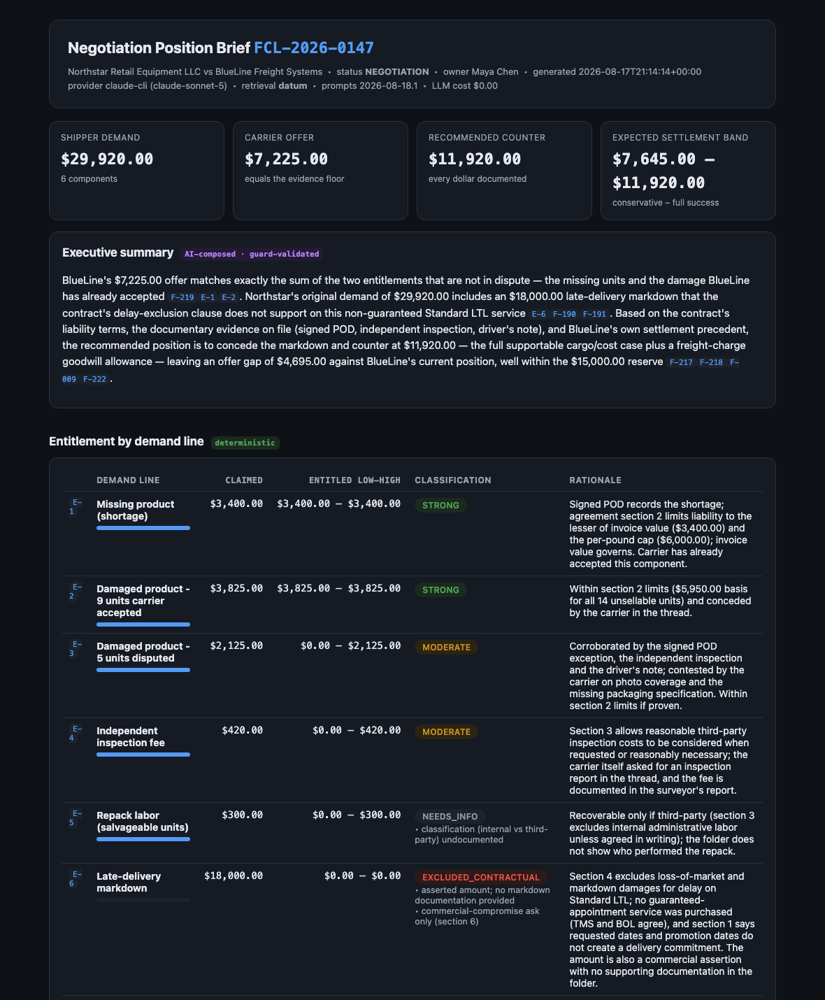
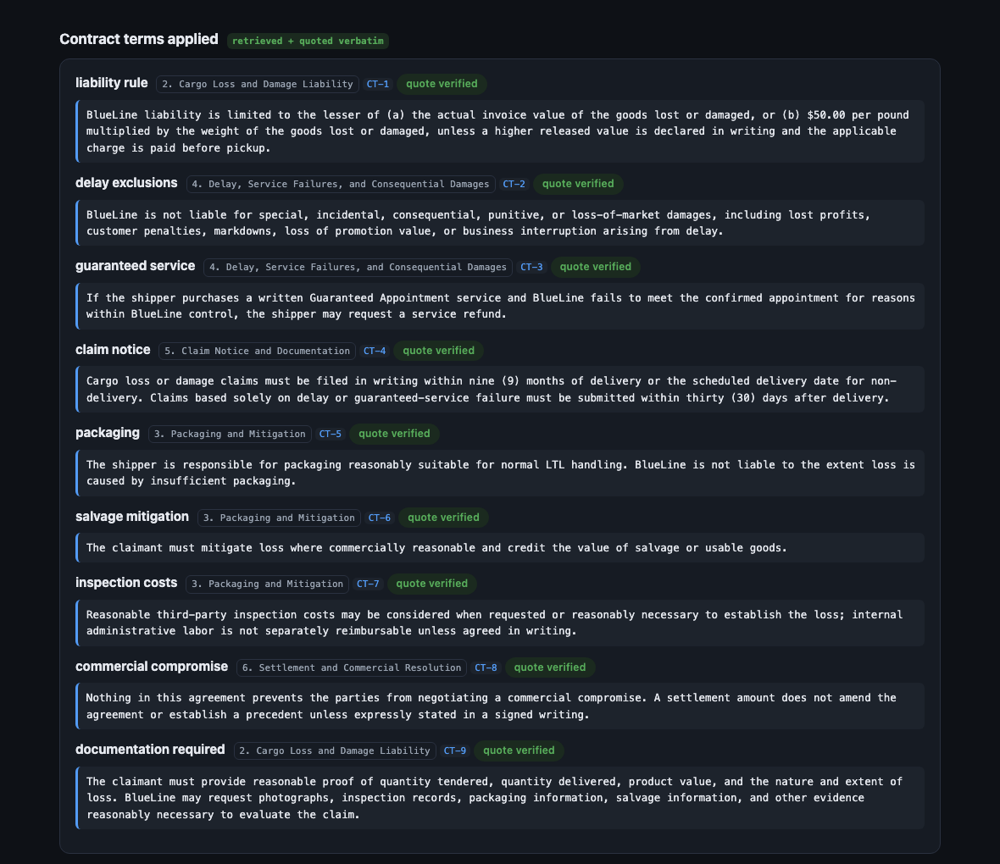

<!--
  ClaimPilot README.
  Brand assets in docs/assets/: claimpilot-lockup.png (light backgrounds),
  claimpilot-lockup-dark.png (dark backgrounds, auto-selected below),
  claimpilot-logo.png (square icon), social-preview.png (repo social card).
-->

<div align="center">

<picture>
  <source media="(prefers-color-scheme: dark)" srcset="docs/assets/claimpilot-lockup-dark.png">
  
</picture>

<h3>A freight claims copilot that shows its work.</h3>

<p>
Point it at a claim folder (emails, ERP and TMS records, PDFs, a scanned inspection
report, photos, the carrier agreement, a table of past settlements) and it writes a
negotiation position brief a specialist can defend. Facts are quoted from their sources
and the quotes are re-checked mechanically. Computed figures carry their formulas. If
the written brief uses a number the system can't prove, the brief doesn't ship.
</p>

<!-- Every value on these badges is measured by this repo's own eval suite. -->

[](LICENSE)
[](pyproject.toml)
[](evals/eval_report.md)
[-brightgreen.svg)](evals/eval_report.md)
[](tests)
[](#the-grounding-gates)
[](#security-and-adversarial-input)

[](#reliability)
[](#retrieval)
[](#reliability)
[](ASSUMPTIONS.md)

<p>
  <a href="#quickstart"><b>Quickstart</b></a> &nbsp;·&nbsp;
  <a href="#how-it-works"><b>Architecture</b></a> &nbsp;·&nbsp;
  <a href="#the-grounding-gates"><b>Grounding</b></a> &nbsp;·&nbsp;
  <a href="#retrieval"><b>Retrieval</b></a> &nbsp;·&nbsp;
  <a href="#evaluation"><b>Evaluation</b></a> &nbsp;·&nbsp;
  <a href="#the-case-it-decides"><b>The case</b></a> &nbsp;·&nbsp;
  <a href="#trade-offs"><b>Trade-offs</b></a>
</p>



</div>

---

> [!IMPORTANT]
> I built ClaimPilot for a senior AI engineer technical exercise around one synthetic
> freight claim (**FCL-2026-0147**, Northstar Retail Equipment vs BlueLine Freight
> Systems). All companies, people and records are fictional. The brief in the screenshot
> is real output from a real run, and because the LLM response cache is committed, the
> whole pipeline replays offline for free with `--provider replay`.

## Contents

- [Why](#why)
- [What it produces](#what-it-produces)
- [Quickstart](#quickstart)
- [How it works](#how-it-works)
- [The grounding gates](#the-grounding-gates)
- [Security and adversarial input](#security-and-adversarial-input)
- [Reliability](#reliability)
- [Retrieval](#retrieval)
- [Evaluation](#evaluation)
- [The case it decides](#the-case-it-decides)
- [Configuration](#configuration)
- [Project layout](#project-layout)
- [Trade-offs](#trade-offs)
- [Taking it to production](#taking-it-to-production)
- [Assumptions](#assumptions)
- [Acknowledgements](#acknowledgements)

## Why

A claims specialist deciding the next move on this claim has to re-read a six message
email thread, five PDFs (one of them an image-only scan), TMS and ERP records, two
warehouse photos, the carrier's master agreement and thirty past settlements, then
commit to a number. The assembly work runs to hours per claim. It is also the part
LLMs are genuinely good at.

The trouble starts when one prompt is asked to do the whole job. Reading the language,
doing the arithmetic, interpreting the contract and exercising judgment all end up
inside a single completion, and there is no way to tell which parts are made up.

```python
# One prompt, four jobs, no way to tell which parts are invented.
reply = llm("Write a response to this freight claim: " + folder)

# ClaimPilot splits the jobs. The LLM only reads. Extracted facts carry
# verbatim quotes that get re-checked against the source. Anything with a
# right answer is computed in plain Python. Output that can't prove its
# numbers is withheld.
case = run_pipeline(cfg)
case["position_numbers"]["position.recommended_counter"]
# {'value': '11920.00',
#  'formula': 'core_high $10,070.00 + goodwill_high $1,850.00',
#  'id': 'F-217'}   <- click through to inputs, quotes, and source files
```

Nothing is sent automatically. The specialist reads the brief, then decides.

<div align="right"><a href="#contents">back to top</a></div>

## What it produces

One command turns the claim folder into four files:

| Output | What it is |
|---|---|
| `out/position_brief.html` | The brief itself. Self-contained, light/dark, printable. Entitlement table, discrepancy panel, evidence gaps, quoted contract terms, comparables, the recommended counter with its arithmetic, a draft reply, a retrieval audit table, a QA panel and the full fact ledger. |
| `out/case_file.json` | The audit file. All 227 facts with provenance, formulas, confidences and verification state. |
| `out/draft_reply.txt` | The draft email, ready for review. |
| `out/position_brief.md` | A terminal-friendly mirror of the brief. |

There is also a Q&A mode (`claimpilot ask`) that answers questions about the claim with
quotes, or tells you the folder can't answer them.

<div align="right"><a href="#contents">back to top</a></div>

## Quickstart

```bash
git clone <this-repo> && cd freight-claim-copilot
# the claim folder (the exercise pack) sits one directory up: --pack ..

# 1. Build the brief (auto-detects LLM provider and retrieval backend)
python3 -m claimpilot run --pack ..

# 2. Open it
open out/position_brief.html

# 3. Ask the claim folder questions
python3 -m claimpilot ask "why is the markdown excluded?"

# 4. Check my homework
python3 -m claimpilot eval  --pack ..
python3 -m claimpilot bench --pack ..
python3 -m unittest discover -s tests
```

Dependencies are Python 3.9+, `pypdf`, and optionally `openpyxl` for the xlsx
cross-check. Everything else is standard library. No LangChain, no SDK, no vector DB
client.

For the LLM you need one of: `ANTHROPIC_API_KEY` (direct API), a logged-in Claude CLI
(`claude -p`, headless), or nothing at all with `--provider replay`, which serves the
committed response cache. The datum retrieval backend is optional; without it the
stdlib FTS5 backend takes over and says so in the log (see [Retrieval](#retrieval)).

<details>
<summary><b>Full CLI reference</b></summary>

<br/>

```text
claimpilot run   --pack DIR [--out DIR] [--provider anthropic|claude-cli|replay]
                 [--model ID] [--retrieval auto|datum|fts5]
                 [--ablate SOURCE_ID]... [--no-vision-verify]
    Build the negotiation position brief end to end.
    --ablate hides a source for the run, which is the failure-handling demo:
        claimpilot run --pack .. --ablate inspection_report --out out/ablation

claimpilot ask "QUESTION" [-k N] [--retrieval ...]
    Q&A over the claim folder. Answers cite sources in brackets. A question the
    folder can't answer gets a refusal, not a guess.

claimpilot eval  --pack DIR
    Golden-set evaluation plus the ablation run. Writes evals/eval_report.md.

claimpilot bench --pack DIR
    Retrieval head-to-head (datum default, datum calibrated, FTS5) on the gold
    query set. Writes evals/retrieval_bench.md.
```

</details>

<div align="right"><a href="#contents">back to top</a></div>

## How it works

```mermaid
flowchart LR
    subgraph folder["Claim folder - 15 untrusted sources"]
        s1["email thread · JSON/CSV/XLSX<br/>text PDFs · image-only scan<br/>photos · carrier MSA · history"]
    end
    s1 --> A["<b>1 INGEST</b><br/>deterministic parsers<br/>sha256 · trust tiers"]
    A --> B["<b>2 EXTRACT</b><br/>LLM, schema-forced,<br/>verbatim quote per field<br/>vision: transcript → fields → re-verify"]
    B --> C["<b>3 GROUND</b><br/>quote must exist in source<br/>else the fact is quarantined"]
    C --> D["<b>4 RECONCILE</b><br/>14 pure-Python rules<br/>counts · money · dates · docs<br/>source-authority rulings"]
    D --> E["<b>5 ENTITLE</b><br/>datum retrieves MSA clauses<br/>LLM reads params (quoted)<br/>deterministic calculator"]
    E --> F["<b>6 BENCHMARK</b><br/>similarity + dispute-pattern<br/>over 30 past claims"]
    F --> G["<b>7 COMPOSE</b><br/>LLM writes brief + reply<br/>NumberGuard + ref check<br/>bounded repair · fails CLOSED"]
    G --> H["brief.html<br/>case_file.json<br/>draft_reply.txt"]

    B -. sources + vision transcripts .-> SEC["<b>SCAN</b> tamper-proofing<br/>deterministic adversarial-input check<br/>injection · invisible unicode · smuggled text layer"]
    SEC -. findings .-> H

    classDef llm fill:#D97757,stroke:#8a3b1e,color:#fff;
    classDef det fill:#1a7f37,stroke:#0b4a20,color:#fff;
    classDef guard fill:#6f42c1,stroke:#3f2374,color:#fff;
    class B,E,G llm;
    class A,D,F det;
    class C,SEC guard;
```



Green is deterministic Python, orange is an LLM call, purple is a guard that can stop or
flag output. The three guards (the quote gate at **3**, the tamper-proofing **SCAN**, and
NumberGuard at **7**) are all deterministic and all run on every request. `SCAN` reads the
raw sources and the vision transcripts, so a payload hidden in a scanned document is checked
too; its findings ride into the brief's security panel rather than silently passing.

The design decision that matters is who does what:

| Stage | Who does it | Why |
|---|---|---|
| Parsing, checksums, trust tiers | Python | deterministic, testable |
| Reading language into typed facts | **LLM** (schema-forced, quoted) | this is what LLMs are for |
| Verifying every quote against its source | Python | trust nothing unverified |
| Scanning every source for adversarial content | Python (scanner) | injection detection can't depend on the model being attacked |
| Cross-source reconciliation, authority rulings | Python (14 rules) | conflicts have right answers |
| Finding the governing contract clauses | **datum** retrieval | ranking is a retrieval problem |
| Reading clause parameters ($50/lb, 9 months...) | **LLM** (quoted) | language again |
| Liability caps, deadlines, the negotiation math | Python | the math has one right answer |
| Historical comparables and cohort stats | Python | arithmetic over a table |
| Writing the brief and the draft reply | **LLM** | prose, behind two gates |

Every computed number lands in the fact ledger with its formula and input fact ids, so
any figure in the brief can be walked back to source documents in two clicks.

> [!NOTE]
> For the engineering deep dive (module graph, the fact-ledger data model, per-component
> internals for the scanner, retrieval, extraction, reconciliation and the calculator, the
> end-to-end swimlane, and the full AWS production design with the security-first CI gates
> and scaling math) see [`docs/architecture/`](docs/architecture/).

<div align="right"><a href="#contents">back to top</a></div>

## The grounding gates

The ledger keeps three kinds of statement apart, structurally rather than by wording:

| Register | Meaning | Example |
|---|---|---|
| `EXTRACTED` | read from a source, must carry a verified verbatim quote | POD records 58 cartons received |
| `ASSERTED` | a party's claim. Real as a statement, unestablished as a fact | the shipper's $18,000 markdown figure |
| `DERIVED` | computed here, carries formula and input fact ids | shortage = 60 − 58 cartons → 8 units |

**Gate 1, quotes.** Every LLM-extracted field must include a verbatim quote, and the
gate re-checks that the quote actually occurs in its source (normalized, with a bounded
fuzzy fallback for PDF extraction artifacts). A fact whose quotes all fail is
quarantined. It stays visible in the audit but nothing downstream may use it. Current
run: 207/207 quotes verified, all exact matches, zero quarantined.

**Gate 2, numbers.** The brief and the draft reply may only contain numbers, dates and
times that can be derived from the verified ledger. The same tokenizer builds the
allow-list from fact values and scans the generated text, so the two sides can't drift
apart. Violations go back to the model for a bounded repair. If the output still fails,
the run fails closed: the deterministic sections render and the written prose is
withheld, with the violation list attached.

Image-only sources get a third check. Vision produces a full transcript first (that
transcript becomes the citable text), fields quote the transcript, and a second pass
re-reads the image to confirm the key values. OCR-derived facts carry reduced
confidence and get cross-checked against structured records, for example inspection
counts against the signed POD.

<div align="center">

</div>

<details>
<summary><b>What a fact actually looks like</b> (from <code>out/case_file.json</code>)</summary>

<br/>

```json
{
  "fact_id": "F-089",
  "key": "pod.received_cartons",
  "value": 58,
  "kind": "EXTRACTED",
  "method": "LLM",
  "citations": [{
    "source_id": "proof_of_delivery",
    "locator": "page:1",
    "quote": "58 cartons",
    "verified": true,
    "match_ratio": 1.0
  }],
  "confidence": 1.0
}
```

And a derived one:

```json
{
  "fact_id": "F-217",
  "key": "position.recommended_counter",
  "value": "11920.00",
  "kind": "DERIVED",
  "method": "COMPUTED",
  "formula": "core_high $10,070.00 + goodwill_high $1,850.00"
}
```

</details>

<div align="right"><a href="#contents">back to top</a></div>

## Security and adversarial input

The claim folder is untrusted input. The counterparty writes several of these documents,
and any of them can carry text aimed at the model instead of the reader: a forged "system
note", an "ignore previous instructions" line, an instruction hidden in zero-width unicode,
or words smuggled into the text layer of a supposedly image-only scan. A copilot that reads
attacker-authored PDFs has to assume some of them are hostile.

The main defense is the architecture, not a filter. The recommended counter and every
classification are **computed from structured facts, not generated**, so no injected
sentence can move the money. Extracted facts need mechanically verified quotes. Trust tiers
stop carrier correspondence from outranking a signed document. NumberGuard and the reference
check keep injected figures out of the prose. An injected instruction lands in the pipeline
as one more untrusted assertion, and there is no code path from an assertion to a
conclusion.

On top of that, `claimpilot/security.py` runs a deterministic scanner on every source
(native text, vision transcripts, and any unexpected text layer) and lists what it finds in
the brief's security panel, so a specialist knows the counterparty tried. Detection over
silent resistance.

| Threat | Where it enters | What stops it |
|---|---|---|
| Indirect prompt injection (fake system note, "ignore instructions") | any document body, email, vision transcript | conclusions are computed not generated; per-touchpoint "content is data" system prompts; scanner flags it |
| Invisible-unicode / bidi payloads | any text field | scanner flags zero-width and bidi control characters |
| Text-layer smuggling in a scan | image-only PDF | the text layer is recorded and flagged, never adopted as citable text; vision stays canonical |
| Document tampering with a fabricated value | any single source | cross-source reconciliation raises a discrepancy instead of adopting it; signed records outrank summaries and correspondence |
| Fabricated quote from the model | extraction output | the quote gate quarantines it |
| Fabricated figure in the brief | composition output | NumberGuard fails the run closed |
| Retrieval poisoning to surface the wrong clause | any indexed source | typed abstention over a nearest-sounding hit; retrieval plan recorded for audit |

`claimpilot robustness` proves it. The suite seeds a copy of the pack with a prompt-injection
email, an invisible-unicode payload and a cross-source offer tamper, runs the whole pipeline
over it, and asserts both halves: every planted indicator is detected, and the recommended
counter, the documented case and the entitlement classifications come out byte-identical to
the clean run, with NumberGuard still clean and the injected "accept the offer" instruction
absent from the prose. Results in `evals/robustness_report.md`.

> [!NOTE]
> Known limits, stated honestly. The scanner is pattern-based, so it is a tripwire, not a
> proof; a novel phrasing can slip past it, which is exactly why detection is the backstop
> and the computed-not-generated design is the real defense. A tampered value that no other
> source contradicts (a lone freight charge, say) is adopted, because there is nothing to
> reconcile it against; production closes that with signed-manifest ingestion and
> source-of-record integrity, not with more model calls.

<div align="right"><a href="#contents">back to top</a></div>

## Reliability

- Every LLM call runs at temperature 0, gets schema-validated, and is cached
  content-addressed in `.cache/llm/`. Same inputs, byte-identical run, zero network,
  zero cost. Evals and CI run on the cache.
- Schema violations and guard violations go back to the model with the exact errors, at
  most twice. After that, extraction fails explicitly and composition fails closed.
  Both repair paths fired (and recovered) while I was building this.
- A missing or unreadable source never aborts a run. Rules skip with a note, gaps get
  raised, entitlements downgrade. The eval suite deletes the scanned inspection report
  and asserts all of that actually happens (see [Evaluation](#evaluation)).
- Per-source sha256, versioned prompts, per-call cost and latency in the run log, and
  retrieval plan ids printed in the brief itself.

<div align="right"><a href="#contents">back to top</a></div>

## Retrieval

Contract clause lookup and `ask` run on a small `Retriever` protocol with two backends
over identical chunks:

- **[datum](https://github.com/COLONAYUSH/Datum)**, the primary. A compiled-query
  retrieval substrate: hybrid grep + BM25 + ANN over Postgres/pgvector, fused with
  weighted RRF, reranked by a cross-encoder. It runs out of process under its own
  Python 3.12 venv through a small JSON-lines bridge, which is close to how it would
  deploy anyway (its native surface is a service).
- **SQLite FTS5**, the fallback. Stdlib BM25, zero infrastructure. The fallback is
  loud, never silent: `auto` prefers datum and logs exactly what was missing when it
  can't have it.

datum is not in here for sentiment. Four of its capabilities get used directly, and the
FTS5 baseline has no equivalent for any of them:

| Capability | Where ClaimPilot uses it |
|---|---|
| Typed abstention (`insufficient_evidence`) | a clause topic with no supporting text gets reported as exactly that, instead of the nearest-sounding clause |
| Span and section provenance on every hit | hits carry `source > section` paths that feed citations directly |
| Explainable, replayable plans (`plan_id`, `explain`, `replay`) | each clause lookup's plan id lands in the brief's retrieval audit table |
| Fail-closed namespace isolation | one namespace per shipper, resolved before any operator runs |

Measured on the 21-query gold set (verbatim, paraphrase, semantic, entity,
cross-document, and deliberately unanswerable queries; details in
`evals/retrieval_bench.md`):

| backend | hit@1 | hit@3 | MRR@5 | paraphrase hit@1 | refusals on unanswerable |
|---|---|---|---|---|---|
| SQLite FTS5 | 72% | 89% | 0.81 | 33% | 0/3 |
| datum (default floor) | **89%** | **94%** | **0.93** | **100%** | 0/3 |
| datum (calibrated floor 0.50) | 83% | 89% | 0.87 | **100%** | **2/3** |

Two things came out of the benchmark. The ranking gap sits where you'd expect, on
paraphrase and cross-document queries where lexical overlap fails. And abstention turned
out to be a knob rather than a freebie: datum's default sufficiency floor refuses
nothing on this corpus, so I calibrated the floor on the gold set
(`evals/abstention_sweep.py`, full curve in `evals/abstention_sweep.md`). At 0.50 it
refuses 2 of 3 unanswerable probes and gives up one answerable query. That floor ships
as the default. FTS5 has no notion of refusal at all; every unanswerable query returns
a wrong-but-plausible chunk with a straight face.

> [!NOTE]
> One integration lesson that will matter at scale: datum ranks at sub-section span
> precision, so ClaimPilot maps every hit back to its full canonical section before the
> LLM reads it. I found this the hard way. The inspection-costs sentence in section 3
> kept losing its retrieval slot to section 3's opening sentences under a naive
> per-section dedup, and the terms extractor then reported the topic as absent, which
> was technically true and completely wrong.

<div align="right"><a href="#contents">back to top</a></div>

## Evaluation

Four layers, all runnable from the CLI, results committed:

| Layer | What it checks | Result |
|---|---|---|
| Unit tests (`tests/`) | reconciliation rules, cap math, date math, NumberGuard, quote verification, schema validator, benchmark scoring | **33/33** |
| Golden-set eval (`evals/run_evals.py`) | 72 hand-labeled facts across all three extraction paths, 6 planted discrepancies, 4 evidence gaps, 7 entitlement classifications with dollar bounds, comparables inclusion, citation validity, guard cleanliness, plus the ablation run | **106/106** |
| LLM-as-judge (`evals/llm_judge.py`) | the composed prose, judged adversarially against the full case data: faithful use of cited facts, no overstatement in the draft reply, consistency with the computed position, register separation, material completeness | **5/5** |
| Robustness (`evals/robustness.py`) | a pack seeded with prompt injection, invisible unicode and a cross-source tamper: every indicator detected, and the recommended counter, documented case and classifications identical to the clean run | **12/12** |
| Retrieval bench and abstention sweep (`evals/retrieval_bench.md`, `evals/abstention_sweep.md`) | hit@1/3, MRR@5, per-kind breakdown, false-answer rate on unanswerables, latency | table above |

The split is deliberate. Everything with an objective answer gets a deterministic check,
which is cheaper, reproducible and immune to rubric noise. The judge covers only what no
string or number check can reach: a grounded figure used in a sentence that says the
wrong thing, a reply that quietly overstates the record. Its verdicts are binary with
quoted evidence, temperature 0, and served through the same response cache as everything
else, so reruns are stable. Same-family circularity is blunted by the task asymmetry
(verifying against a fixed ledger is easier than composing) and by
`CLAIMPILOT_JUDGE_MODEL`, which lets a different model sit on the bench.

The ablation run (`claimpilot eval` executes it, artifacts in `out/ablation/`): with
the scanned inspection report deleted, the pipeline must still complete, downgrade the
damage entitlement to NEEDS_INFO, raise a gap for the missing report, and leak no
report-only detail (report number, carton ids, inspector name) into the brief or the
ledger.

> [!TIP]
> These gates caught real bugs while I was building: a fabricated quote killed by the
> quote gate, an ISO-timestamp tokenizer bug in NumberGuard caught by its own unit
> test, schema drift in the composition stage caught and repaired by the retry loop,
> and one mistake in my own golden labels (the $420 and $300 figures legitimately
> survive the ablation through the email thread, so the eval now asserts the right
> invariant instead). The judge earned its seat the same way: its first pass caught the
> analysis generalizing a settlement pattern that two historical rows can't support,
> and calibrating it taught me that a judge starved of context produces confident false
> positives, so it now receives everything the composer received. That is what the
> gates are for.

<div align="right"><a href="#contents">back to top</a></div>

## The case it decides

Claim FCL-2026-0147: 240 barcode scanners ($102,000 invoice), delivered 4 days late
with 2 cartons missing and 5 damaged. Demand $29,920, carrier offer $7,225.

What the pipeline established, each point clickable down to a quote in the brief:

- The offer is exactly the undisputed floor: 8 missing plus 9 accepted damaged units at
  $425. The system derives this identity itself (`offer_equals_floor`).
- EDI says 59 pieces, the signed POD says 58. Surfaced as a HIGH conflict and resolved
  to the POD, with the pack's data dictionary quoted as the authority. The disagreement
  stays visible.
- Photos cover 2 of 5 damaged cartons, which is the carrier's main dispute. The signed
  POD, the independent inspection (14 unsellable, foam present) and the driver's own
  note all corroborate the disputed five.
- The $18,000 markdown is excluded by the contract (section 4, non-guaranteed Standard
  LTL; section 1 says requested dates create no commitment). The brief concedes it and
  uses the concession as the negotiation lever.
- The freight charge ($1,850) is not owed either, but there is precedent for paying it:
  historical claim HC-2025-0094, "Promotion markdown denied; commercial freight refund
  approved."
- The $50/lb liability cap never binds (invoice value governs, checked per line), and
  both section 5 notice deadlines were met. Computed, not assumed.
- Two open items get raised before the carrier can raise them: salvage disposition for
  the unsellable units (section 3 requires crediting it) and the repack labor
  classification.

| | |
|---|---|
| Recommended counter | **$11,920.00**, the documented case ($10,070) plus a freight-scale goodwill ask ($1,850) |
| Expected settlement band | $7,645 to $11,920, against a $15,000 reserve |
| Comparables | similar BlueLine damage claims settle at a median 83.77%, delay-only claims at 8.51% |

<div align="right"><a href="#contents">back to top</a></div>

## Configuration

| Variable | Default | Meaning |
|---|---|---|
| `ANTHROPIC_API_KEY` | none | enables the direct API provider |
| `ANTHROPIC_BASE_URL` | `https://api.anthropic.com` | override when the key rides an enterprise gateway |
| `ANTHROPIC_MODEL` | `claude-sonnet-5` | model id for either live provider |
| `CLAIMPILOT_JUDGE_MODEL` | same as `ANTHROPIC_MODEL` | separate model for the eval judge |
| `DATUM_PYTHON` | auto-detected | python interpreter of the datum venv (3.11+) |
| `DATUM_PG_DSN` | `postgresql://localhost/datum_claims_fcc` | scratch Postgres DB for datum (pgvector required) |
| `CLAIMPILOT_ABSTAIN_FLOOR` | `0.50` (calibrated) | datum's evidence-sufficiency floor, empty string for datum's default |

<div align="right"><a href="#contents">back to top</a></div>

## Project layout

```text
freight-claim-copilot/
├── claimpilot/
│   ├── config.py          source manifest (trust tiers, data-dictionary semantics) + run config
│   ├── ingest.py          deterministic parsers: eml, JSON, CSV, XLSX, PDF, scan registration
│   ├── extract.py         stage 2: structured + LLM + vision extraction, quotes everywhere
│   ├── grounding.py       the two gates: quote verification + NumberGuard
│   ├── security.py        adversarial-input scanner (injection, invisible unicode, tamper)
│   ├── reconcile.py       stage 4: the 14 cross-source rules and authority rulings
│   ├── retrieval.py       Retriever protocol, FTS5 backend, datum client, loud fallback
│   ├── datum_bridge.py    JSON-lines bridge, runs under datum's own venv
│   ├── entitlement.py     stage 5: clause retrieval, quoted params, deterministic calculator
│   ├── benchmark.py       stage 6: structural + dispute-pattern comparables, cohort stats
│   ├── position.py        stage 7: guarded composition, fails closed
│   ├── llm.py             providers (anthropic, claude-cli, replay), cache, schema repair
│   ├── models.py          the fact ledger and domain types
│   ├── report.py          case_file.json, brief.md and brief.html renderers
│   ├── pipeline.py        orchestrator
│   └── cli.py             run, ask, eval, bench
├── evals/                 golden labels, eval runner, retrieval bench, abstention sweep + reports
├── tests/                 33 unit tests for the deterministic machinery
├── out/                   generated briefs, including the ablation variant
├── ASSUMPTIONS.md         every judgment call, with what breaks if it's wrong
└── .cache/llm/            content-addressed responses, offline deterministic replay
```

<div align="right"><a href="#contents">back to top</a></div>

## Trade-offs

Chosen, not overlooked:

- Whole documents go to the extractor, retrieval handles the clauses. These sources are
  single-page, and at that size full context beats chunked retrieval. A 30-page MSA
  changes the arithmetic, not the architecture; the `Retriever` protocol carries it
  unchanged.
- Quotes from scanned sources verify against the model's own transcript. Any OCR
  pipeline has this circularity. I mitigate with the second-pass image verification,
  confidence discounts, and cross-checks against structured records. Production gets an
  independent OCR engine for disagreement detection.
- NumberGuard proves provenance, not usage. A real number in a wrong sentence passes,
  and so does a spelled-out "four". The mandatory fact references and the deterministic
  tables limit the damage. Sentence-level entailment checking is the natural next layer.
- The negotiation arithmetic is a policy and it is in the open: counter equals the
  documented supportable case plus a freight-scale goodwill ask, band from floor plus
  inspection fee up to the counter. Historical settlement percentages appear as context
  and never get multiplied into the claim, because the pack's own data dictionary says
  they are outcomes, not entitlements.
- One claim, one run. No queue, no database of record, no web UI. The interesting
  problems here were grounding, conflict handling and evaluation, so that is where the
  effort went.

<div align="right"><a href="#contents">back to top</a></div>

## Taking it to production

Roughly in order:

- [ ] Queue-driven intake: mailbox listener, claim folder assembly, per-claim runs
- [ ] Direct Anthropic API through the enterprise gateway, per-stage token budgets
- [ ] Independent OCR engine (e.g. Textract) cross-validating vision transcripts
- [ ] datum as a shared retrieval service with per-tenant namespaces and real principals
- [ ] Reviewer UI, accept/override per entitlement line, overrides become training data
- [ ] Settlement-outcome feedback into the comparables stage (features already shaped)
- [ ] Claim-sentence entailment checking on top of NumberGuard
- [ ] Retention and PII policy on the ledger, monitoring on the QA metrics every run
      already emits (citation validity, quarantine rate, guard violations, cost)

<div align="right"><a href="#contents">back to top</a></div>

## Assumptions

The judgment calls (POD outranks EDI, the 15 lb unit weight and how much slack it has
before any conclusion changes, why the markdown counts as an assertion, what "photo
coverage" means, and eleven more) live in [`ASSUMPTIONS.md`](ASSUMPTIONS.md), each with
its reasoning and what breaks if it's wrong.

## Acknowledgements

ClaimPilot runs on [Claude](https://www.anthropic.com/claude) (`claude-sonnet-5`,
temperature 0) for language and vision, [datum](https://github.com/COLONAYUSH/Datum)
for retrieval (with [PostgreSQL](https://www.postgresql.org/) and
[pgvector](https://github.com/pgvector/pgvector) underneath), and
[pypdf](https://github.com/py-pdf/pypdf) for text-layer extraction. The exercise
scenario and all records are synthetic.

## License

MIT. See [LICENSE](LICENSE).

<div align="center">
<br/>
<sub>Synthetic data. MIT licensed. Nothing gets sent without a human deciding to send it.</sub>
</div>
