# 01 - System architecture

The current codebase, at the level of who calls what, what data moves between stages, and
where the determinism boundary sits. About 5,500 lines of Python across `claimpilot/`,
plus `evals/`.

- [Module graph and import direction](#module-graph-and-import-direction)
- [The core data model: the fact ledger](#the-core-data-model-the-fact-ledger)
- [Process and network topology](#process-and-network-topology)
- [The pipeline, stage by stage](#the-pipeline-stage-by-stage)
- [The three deterministic guards](#the-three-deterministic-guards)
- [The datum bridge protocol](#the-datum-bridge-protocol)
- [The LLM provider and cache layer](#the-llm-provider-and-cache-layer)
- [Component internals (deep dive)](#component-internals-deep-dive)
  - [Adversarial scanning engine](#adversarial-scanning-engine)
  - [Retrieval engine internals](#retrieval-engine-internals)
  - [Extraction engine: three paths](#extraction-engine-three-paths)
  - [Reconciliation engine: anatomy of a rule](#reconciliation-engine-anatomy-of-a-rule)
  - [Entitlement calculator](#entitlement-calculator)
  - [NumberGuard tokenizer](#numberguard-tokenizer)
- [Failure and degradation matrix](#failure-and-degradation-matrix)

## Module graph and import direction

Imports run one way: `cli` and `pipeline` sit on top and wire everything; the leaf
modules (`util`, `models`, `config`) depend on nothing internal. Nothing under a stage
imports the orchestrator, so each stage is testable in isolation.

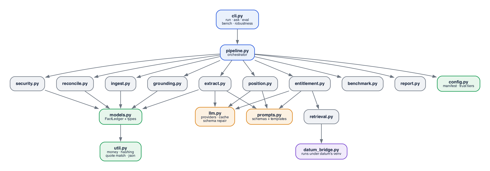

Two design rules hold the shape:

1. **The determinism boundary is a module boundary.** `llm.py` is the only path to a
   model. `reconcile.py`, `entitlement.py` (the calculator half), `benchmark.py`,
   `grounding.py` and `security.py` never import it. If a number is wrong, it is wrong in
   Python I can unit-test, not in a prompt.
2. **`models.py` is the shared vocabulary.** Every stage reads and writes the same
   `FactLedger`, so provenance travels with the data instead of being reassembled at the
   end.

## The core data model: the fact ledger

Everything the system knows is a `Fact` in an ordered `FactLedger` with a by-key index.
Three registers are kept apart by the `kind` field, and nothing promotes one to another
silently.

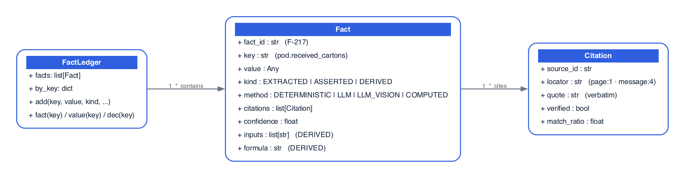

Field notes: `fact_id` is a stable label like `F-217`; `key` is the dotted namespace such
as `pod.received_cartons`; `kind` is one of `EXTRACTED | ASSERTED | DERIVED`; `method` is
`DETERMINISTIC | LLM | LLM_VISION | COMPUTED`; `inputs` and `formula` are populated for
`DERIVED` facts only; a `Citation.locator` looks like `page:1`, `message:4`, or
`$.events[6].pieces`.

| Register | Written by | Rule enforced elsewhere |
|---|---|---|
| `EXTRACTED` | ingest (structured), extract (LLM/vision) | must carry a quote that the quote gate verifies |
| `ASSERTED` | a party's claim (e.g. the markdown figure) | never used as a computed input; the entitlement engine treats it as a claim, not a value |
| `DERIVED` | reconcile, entitlement, benchmark | carries `formula` and `inputs` (the fact_ids it was computed from) |

Because a `DERIVED` fact records its inputs, any figure in the final brief walks back
through `inputs` to the `EXTRACTED` facts it rests on, and from there to a `Citation` with
a source file and a verified quote. That chain is what "traceable" means in this system,
and it is a data-structure property, not a reporting convention.

## Process and network topology

One run spans two Python interpreters and up to two external services. The split exists
because the app targets the system Python 3.9 while datum needs 3.11+, and because datum
is stateful (Postgres). Keeping datum out of process is also how it deploys for real.

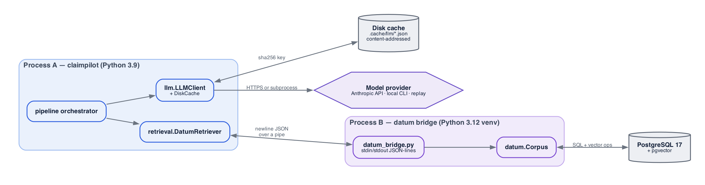

Process boundaries double as isolation boundaries. The bridge speaks one JSON object per
line and nothing else; its stdout is reserved for protocol replies, and every noisy
library (HuggingFace, tqdm) is redirected to stderr so it cannot corrupt the stream.
`HF_HUB_OFFLINE=1` is set on the bridge so a model-hub reachability check never blocks a
query.

## The pipeline, stage by stage

`run_pipeline(cfg)` in `pipeline.py` is the whole control flow. Each row below is a real
function boundary with a fixed contract.

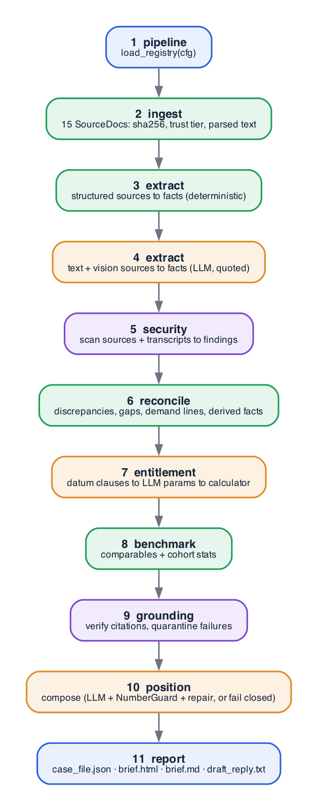

Stage contracts, precisely:

| # | Stage | Input | Output | Determinism |
|---|---|---|---|---|
| 1 | `ingest.load_registry` | `cfg.pack_dir` + `MANIFEST` | `dict[str, SourceDoc]` with sha256, trust tier, parsed text/segments | Pure Python (pypdf, stdlib eml/json/csv/openpyxl) |
| 2 | `extract.run_extraction` | registry, ledger, LLM client | facts added to ledger | Structured sources deterministic; text and image sources LLM, schema-forced, one quote per field |
| - | `security.scan_registry` | registry (incl. vision transcripts) | list of `SecurityFinding` | Pure Python regex/codepoint scan |
| 4 | `reconcile.run_reconciliation` | ledger, registry | `discrepancies`, `gaps`, `demand_lines`, derived facts | 14 pure-Python rules, no LLM |
| 5 | `entitlement.run_entitlement` | ledger, registry, demand lines, retriever, LLM client | `entitlements`, `contract_terms`, position numbers | Retrieval + LLM clause read; caps/deadlines/math deterministic |
| 6 | `benchmark.run_benchmark` | ledger, registry | `comparables`, `cohorts` | Pure Python similarity and stats |
| 3 | `grounding.verify_fact_citations` | ledger, registry | citation QA, quarantines | Pure Python quote match |
| 7 | `position.compose_position` | assembled case input | brief sections + draft reply | LLM behind NumberGuard + reference check + bounded repair |
| - | `report.write_outputs` | the case dict | four files | Pure Python rendering |

(The numbering follows the conceptual order in the README; in code the citation
verification runs just before composition so it can catch quotes added by every prior
stage.)

## The three deterministic guards

None of the guards ask the model to police itself; all three are Python.

**Guard 1, the quote gate** (`grounding.verify_fact_citations`, `util.find_quote`). For
each `EXTRACTED` fact, the cited quote is normalized (NFKC, typographic folding,
whitespace collapse, casefold) and matched against the source text. Exact normalized
substring first; otherwise a bounded fuzzy sliding-window ratio to absorb PDF-extraction
artifacts. A fact whose every citation fails is quarantined: `confidence` drops to 0 and
it is excluded from all downstream reasoning and from the NumberGuard allow-list.

**Guard 2, the adversarial-input scanner** (`security.scan_registry`). Runs on every
source's native text and its vision transcript, plus any text layer found where none
should exist. Five deterministic classes:

| Class | Severity | Catches |
|---|---|---|
| `instruction_override` | HIGH | "ignore/disregard/override ... instructions/prompt/context" |
| `role_marker` | HIGH | `<|...|>`, `[INST]`, `system:` lines, "system note/override" |
| `ai_directive` | MEDIUM | "note/message/instructions to the AI/assistant/LLM", "you are an AI" |
| `invisible_unicode` | HIGH | zero-width and bidi control codepoints |
| `encoded_blob` | LOW | long base64-like runs |

Plus `unexpected_text_layer`: a text layer on a source registered as image-only is
recorded and flagged, and deliberately not adopted as citable text (the vision transcript
stays canonical). Patterns are tuned against the real pack so ordinary freight language
stays quiet.

**Guard 3, NumberGuard** (`grounding.build_allowed_tokens`, `scan_generated_text`). The
same tokenizer builds an allow-list of numbers, dates, times and percents from the
non-quarantined ledger values and scans the generated brief and reply. Any token that
cannot be derived from the ledger is a violation. Violations are fed back for a bounded
repair; if the output still fails, composition fails closed and the written prose is
withheld while the deterministic sections still render.

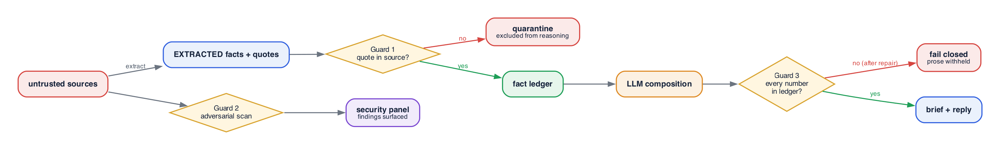

## The datum bridge protocol

`retrieval.DatumRetriever` manages one long-lived bridge subprocess and talks to it with
five verbs. The heavy cost (loading the embedder and cross-encoder on CPU) is paid once
at `open`, then queries are warm.

| Verb | Request | Reply |
|---|---|---|
| `open` | dsn, namespace, principal, abstain_floor | ok + info |
| `ingest` | list of `{source_id, markdown}` | ok + write-op count |
| `search` | query, k | status, sufficiency, plan_id, hits[] (content, section_path, score) |
| `explain` | plan_id | the compiled plan text (audit) |
| `close` | - | ok |

The client reads replies with a `selectors`-based loop and a per-verb timeout
(`startup_timeout_s=240` for `open`, `request_timeout_s=120` for the rest), drains stderr
on a daemon thread for diagnostics, and raises `RetrieverUnavailable` on a dead process so
the factory can fall back to FTS5 loudly. Chunks are ingested as markdown whose headings
become datum's section paths, so a hit's provenance lines up with the app's citation
locators. datum ranks at sub-section span precision, so each hit is mapped back to its
full canonical section before the LLM reads it, with the matched span kept for audit.

## The LLM provider and cache layer

`llm.LLMClient` is cache-first, provider-second, with schema validation and a bounded
repair loop around every structured call.

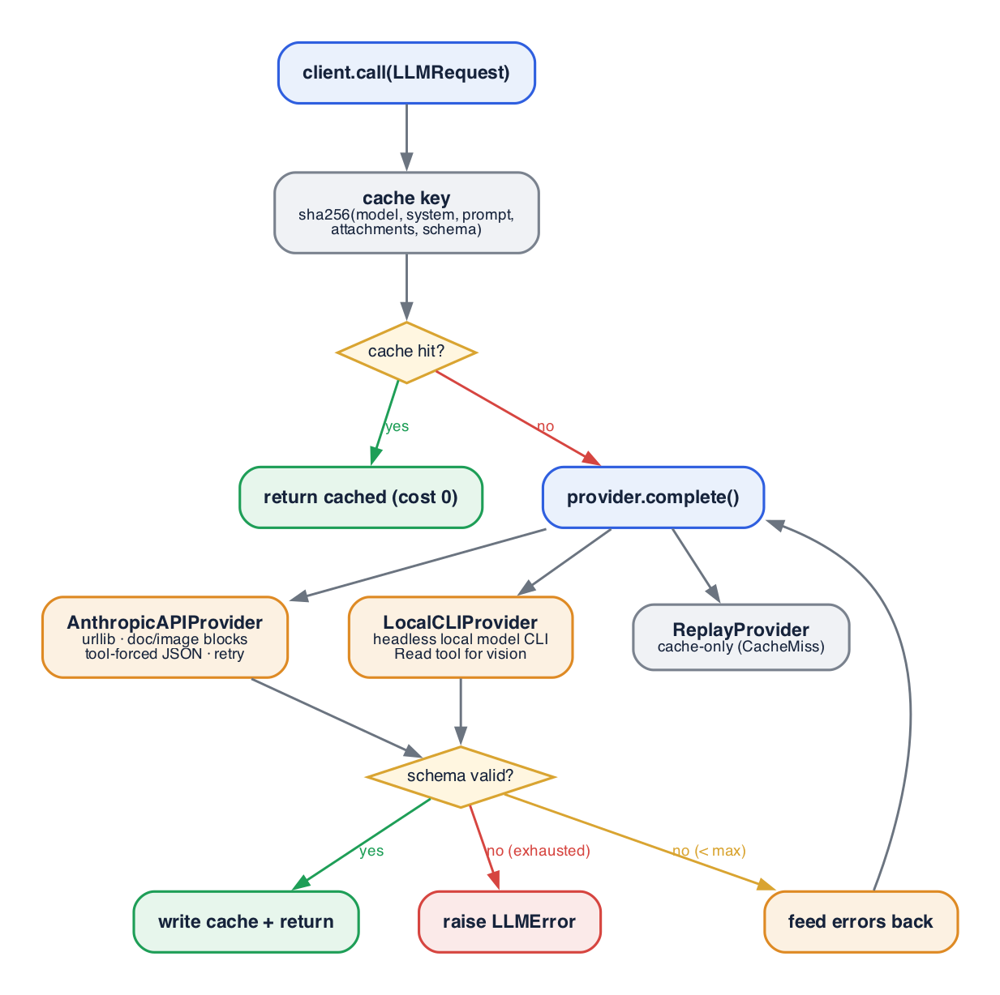

Because the cache key is derived from request content only (not from which provider
served it), a cache populated by any provider replays byte-identically under
`--provider replay`. That is what makes evals and CI deterministic and free, and it is
why every LLM call is temperature 0. The `AnthropicAPIProvider` honors `ANTHROPIC_BASE_URL`
so the same code path works against an enterprise gateway or Bedrock-style endpoint.

## Component internals (deep dive)

The sections above describe what each stage does. These describe how the load-bearing
engines work inside, at the level you would need to modify or defend them.

### Adversarial scanning engine

`security.py` is deterministic and stateless. It never asks the model whether text is an
attack; it matches structure. The engine runs three passes over each source and matches a
fixed set of pattern classes, emitting at most one finding per class per source so the
panel stays readable.

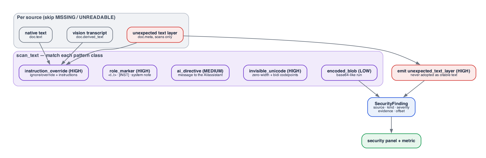

Three properties are deliberate:

1. **It scans the vision transcript, not just native text.** A payload printed inside a
   scanned image reaches the model through the transcript, so the transcript is scanned
   with the same classes. This is the path a naive scanner misses.
2. **The unexpected-text-layer path is both a finding and an ingest decision.** When a PDF
   registered as image-only carries a text layer (an easy way to feed a parser words the
   eye never sees), `ingest._parse_pdf_scan` records it in `doc.meta` and refuses to adopt
   it as citable text; the scanner then emits a HIGH finding and also runs the pattern
   classes over the hidden text.
3. **Tuning is against real freight language.** The patterns were tightened until ordinary
   phrases in the pack ("Special instructions:", "Transportation Management System", "The
   claimant must provide...") produce zero findings, so a HIGH finding means something. The
   scanner is a tripwire by design, and the real defense is that conclusions are computed,
   not generated, so a missed pattern still cannot move a number.

### Retrieval engine internals

Two layers cooperate: the app-side `DatumRetriever` (transport and provenance alignment)
and datum's own compiled-query plan (the retrieval algorithm). A single `search` call
flows through both.

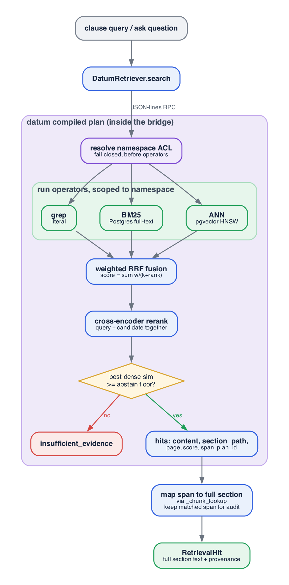

The details that matter:

- **ACL first, fail closed.** The namespace partition resolves before any operator runs, so
  a relevance change can never become a cross-tenant leak. In production this is the
  per-shipper isolation boundary.
- **Fusion is by rank, not raw score.** A BM25 score and a cosine similarity are not the
  same unit, so datum fuses positions (`w_o / (k + rank)`) rather than mixing scales, then
  a cross-encoder reranks the shortlist by reading the query and each candidate together.
- **Abstention is a real plan step.** If the best dense similarity among the fused
  candidates is below the floor, the plan returns `insufficient_evidence` instead of the
  top-ranked chunk. The floor (0.50) is calibrated in `evals/abstention_sweep.py`. FTS5
  cannot express this, which is the capability gap the benchmark exists to show.
- **Span-to-section mapping is the integration fix.** datum ranks at sub-section span
  precision, so the app maps each hit back to its full canonical section (so the LLM reads
  complete clauses) while keeping the matched span in `extra.matched_span` for the audit
  trail. This is the bug from the datum bridge section, closed here.
- **The plan is replayable.** `plan_id` comes back with the hits and goes into the brief's
  retrieval-audit table; `explain(plan_id)` reconstructs the exact plan for audit.

### Extraction engine: three paths

`extract.run_extraction` routes each source down one of three paths by kind. Structured
data never touches the model; language and images do, always with a quote.

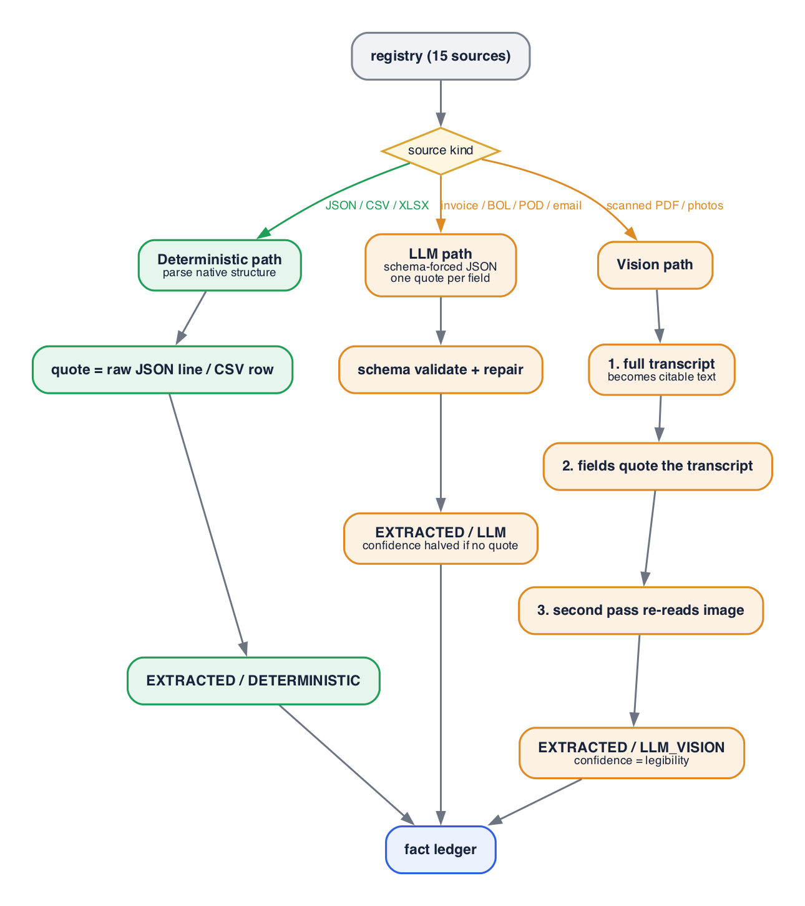

The vision path is the most defended because it is the least trustworthy input. The
transcript is produced first and becomes the source's citable text, so field quotes cite
the transcript rather than an invisible original; a second pass re-reads the image to
confirm the key numbers, and any disagreement drops the fact's confidence. Structured
extraction, by contrast, is a pure function: a JSONPath or row index and the raw line as
the quote, no model in the loop.

### Reconciliation engine: anatomy of a rule

The 14 rules share one context object and one shape: read facts, derive new facts with a
formula, raise discrepancies or gaps, degrade if inputs are missing. A rule that throws is
caught so one bug cannot take down the run.

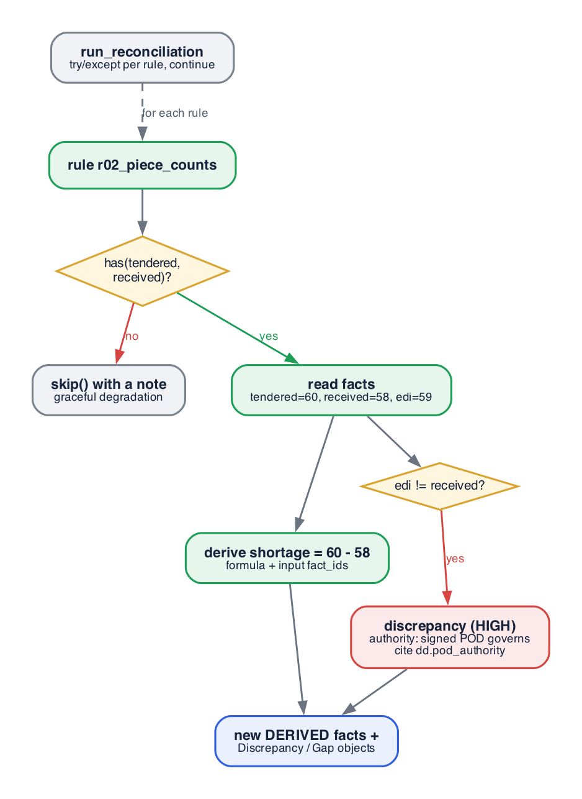

Three mechanisms carry the correctness story:

- **Authority rulings are data, not opinion.** When sources disagree, the rule cites the
  data-dictionary facts (`dd.pod_authority`, `dd.edi_semantics`) that assign authority, and
  records both the ruling and the conflict. The brief shows the disagreement; it does not
  hide it behind the answer.
- **Every derived value carries its formula and inputs.** `ctx.derive(...)` writes a
  DERIVED fact with a human-readable formula and the fact_ids it consumed, which is what
  makes the provenance tree in doc 02 walkable.
- **Degradation is per rule.** A missing input calls `skip()` with a note instead of
  crashing; an unexpected exception is caught by the runner, logged, and the run continues
  with the other rules. Reconciliation is best-effort and additive by construction.

### Entitlement calculator

Stage 5 is a retrieve-read-compute sandwich: retrieval and one LLM read sit between two
deterministic ends, and only the deterministic ends touch money.

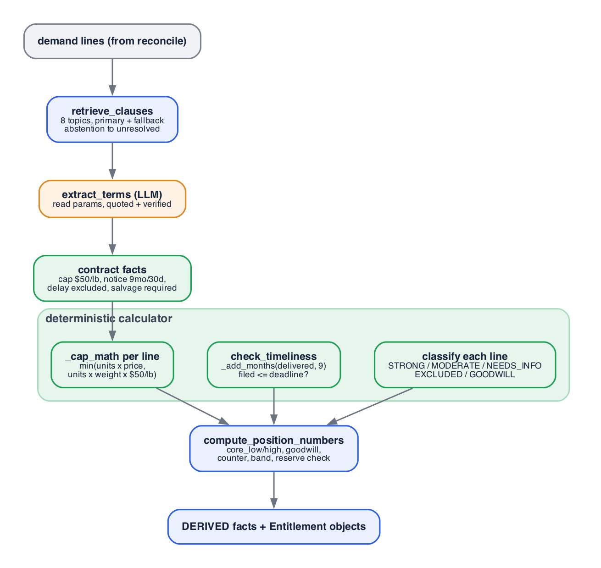

The calculator is where the case's judgment is encoded as arithmetic:

- **Cap math is `min(invoice value, $50/lb x weight)` per line**, with both intermediate
  values written to the ledger so the brief can show why invoice value governs (it does
  here: 22 affected units at ~15 lb gives a $16,500 cap against a $9,350 invoice value).
- **Deadlines are computed, not assumed.** `_add_months` and date arithmetic turn the
  delivery date and the notice periods into concrete deadlines, then check the filing date
  against them.
- **Classification is a decision table**, not a model call. A line is EXCLUDED_CONTRACTUAL
  when the contract excludes it and the service was non-guaranteed (the markdown);
  GOODWILL_LEVER when it is not owed but precedent pays it (the freight refund); NEEDS_INFO
  when recoverability turns on a missing fact (repack labor). The label drives which lines
  sum into `core_high` and which become negotiation levers.

### NumberGuard tokenizer

The guard's strength is that one tokenizer builds the allow-list and scans the output, so
the two can never disagree about what a number is.

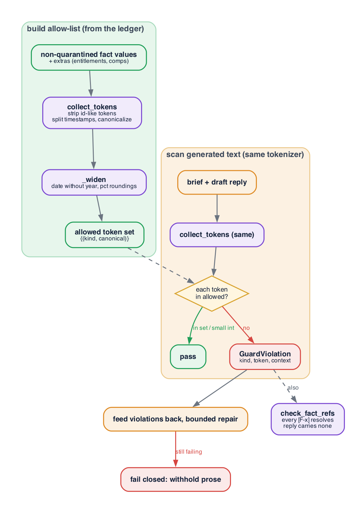

Mechanics worth knowing:

- **Identifier tokens are stripped before number scanning**, so `BLF-77209115` or `[F-217]`
  never registers as a numeric claim; only genuine figures, dates, times and percents are
  checked.
- **The allow-list is widened conservatively**, so benign renderings pass: a date written
  without its year, a percentage rounded to one decimal, an `x.00` money value shown as an
  integer. This keeps the guard from failing on legitimate phrasing while still catching a
  fabricated figure.
- **Small integers pass unconditionally.** Counts like "5 cartons" or "2 photos" and
  section numbers are prose, not claims, so integers at or below a ceiling are allowed
  without a ledger match.
- **Two checks, not one.** Alongside the number scan, `check_fact_refs` confirms every
  bracketed reference resolves and that the draft reply body carries none (it must read as a
  real email). A failure in either path drives the same repair-then-fail-closed loop.

## Failure and degradation matrix

The design rule is that deterministic output never depends on an LLM stage succeeding, and
a missing source degrades rather than aborts.

| Failure | Detected by | Behavior |
|---|---|---|
| Source file missing or unreadable | `ingest.load_source` | registered `MISSING`/`UNREADABLE`; rules skip with a note; gaps raised |
| Scanned PDF has no text layer | `ingest._parse_pdf_scan` | expected; vision transcribes it |
| Unexpected text layer on a scan | same | flagged to the security panel, not adopted |
| LLM returns invalid JSON | `llm.LLMClient` | up to 2 schema repairs, then `LLMError` |
| Extracted quote not in source | Guard 1 | fact quarantined, excluded from reasoning |
| datum venv or Postgres absent | `retrieval.make_retriever` | loud fallback to FTS5 (degraded: lexical only, no abstention) |
| Clause topic has no supporting text | datum abstention | reported as unresolved, not filled with the nearest clause |
| Generated prose has an ungrounded number | Guard 3 | repair, then fail closed (deterministic sections still render) |
| A reconciliation rule throws | `run_reconciliation` | caught per-rule, logged, run continues |
| Adversarial content in a document | Guard 2 | surfaced in the security panel; conclusions unaffected (computed, not generated) |

Next: [02 - Scenario and swimlanes](02-scenario-and-swimlanes.md).
