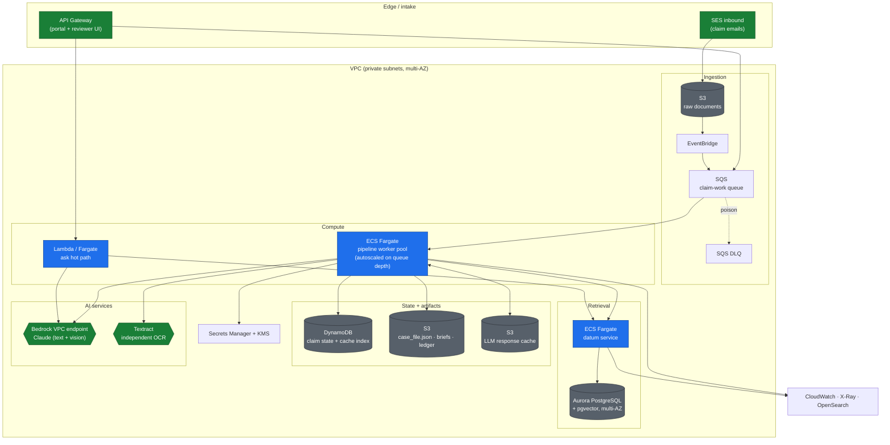
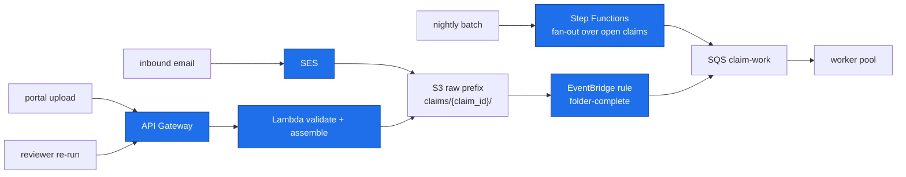
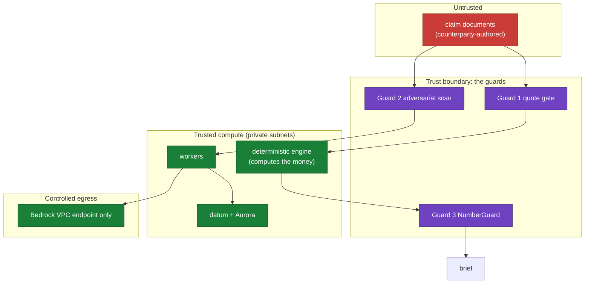

# 03 - Production architecture

How ClaimPilot runs as a service on AWS. The exercise is a single-process CLI; this is
what changes, what gets hosted where, how it scales, and how security sits in front of it
from the CI pipeline onward. Assumptions are mine and stated up front so they can be
argued with.

- [Operating assumptions](#operating-assumptions)
- [Target topology](#target-topology)
- [Intake and triggers](#intake-and-triggers)
- [The worker fleet](#the-worker-fleet)
- [datum as a service](#datum-as-a-service)
- [The model layer](#the-model-layer)
- [State, storage, and the cache](#state-storage-and-the-cache)
- [Network and trust boundaries](#network-and-trust-boundaries)
- [Security-first CI/CD](#security-first-cicd)
- [Observability and SLOs](#observability-and-slos)
- [Scaling math](#scaling-math)
- [Availability, DR, and cost](#availability-dr-and-cost)

## Operating assumptions

| Assumption         | Value                                                                | Why it matters                                          |
| ------------------ | -------------------------------------------------------------------- | ------------------------------------------------------- |
| Volume             | 1,000 claims/day, bursty (about 60% land in a 3-hour morning window) | drives worker count and queue sizing                    |
| Work per claim     | 8 to 12 LLM calls, 5 to 15 minutes wall time, LLM-bound              | the pipeline waits on the model, not on CPU             |
| Interactive`ask` | p95 under 5 seconds                                                  | retrieval + one grounded answer, a separate hot path    |
| Tenancy            | multiple shippers, isolation required                                | datum namespaces, per-tenant IAM and data scoping       |
| Freshness SLA      | brief ready within 15 minutes of intake                              | sets the autoscaling target on queue depth              |
| Data class         | commercial claims, some PII in correspondence                        | KMS everywhere, private subnets, no public model egress |
| Region             | one primary, pilot-light DR in a second                              | cost-aware HA                                           |

## Target topology

Everything runs inside a VPC with private subnets. The model is reached through a VPC
endpoint (Bedrock), so no claim content leaves the AWS network boundary on the default
path.



## Intake and triggers

Each trigger normalizes to the same event: a claim folder assembled in S3 and a message on
the work queue.



A claim is "folder-complete" when its manifest of expected sources is satisfied or a
timeout fires; the EventBridge rule then enqueues it. Missing sources are fine, the
pipeline already degrades and raises gaps, so a partial folder still produces a useful
brief and a list of what to chase.

## The worker fleet

The current pipeline is already a clean orchestrator over independent stages, so the
smallest correct lift is: one Fargate task equals one claim run, pulled from SQS. No
rewrite, and per-claim isolation for free.

- **Why Fargate over Lambda for the pipeline.** A run is 5 to 15 minutes and LLM-bound;
  Lambda's 15-minute ceiling and per-invocation model fit the `ask` hot path but not the
  full pipeline. Fargate tasks are right-sized small (the work is IO-wait on the model,
  not CPU), so a task is cheap and many run concurrently.
- **Concurrency model.** One claim per task keeps tenant isolation and failure blast
  radius at one claim. Within a task the stages are sequential by data dependency; the
  parallelism is across tasks, driven by queue depth.
- **Idempotency.** The content-addressed LLM cache makes re-processing a claim safe and
  mostly free; a retried message re-runs deterministic stages and reuses cached model
  calls. Claim state in DynamoDB is written with a conditional update keyed on claim id +
  attempt, so a duplicate delivery cannot double-write a result.
- **Retries and poison handling.** SQS visibility timeout covers a full run; a message
  that fails `maxReceiveCount` times moves to the DLQ with the partial `case_file.json`
  for triage. A stage that fails closed (composition) still produces a deterministic brief,
  which is a successful outcome, not a retry.

An alternative worth naming: Step Functions as the per-claim orchestrator, one state per
stage, with per-stage retry and native tracing. It buys finer observability and retry
granularity at the cost of turning an in-process call graph into a distributed one. I would
start with the Fargate-worker model and move the high-value stages (extraction, retrieval,
composition) to Step Functions tasks only if per-stage retry or cost attribution demands
it.

## datum as a service

datum is stateful (Postgres) and pays a model-load cost at startup, so it is a
long-running service, not a per-request import.

- **Hosting.** An ECS Fargate service running datum's server surface, behind an internal
  load balancer, fronting Aurora PostgreSQL with pgvector (multi-AZ, with read replicas
  for the query path). Workers and the `ask` path call it over the internal network.
- **Embeddings and reranking.** The default `bge-small` embedder and `bge-reranker-base`
  run on CPU and fit the Fargate task. At higher ingest volume, move embedding to a
  SageMaker serverless inference endpoint and batch it, keeping the datum service itself
  thin.
- **Tenancy.** One datum namespace per shipper, resolved before any operator runs and
  fail-closed, which is exactly the isolation property a multi-shipper claims platform
  needs. A signed hit id never yields content across a namespace boundary.
- **Ingest vs query.** Documents are ingested into datum once per claim (or once per
  corpus for shared references like the MSA and historical claims). The query path
  (clause lookup, `ask`) is read-mostly and scales on Aurora read replicas plus datum task
  count.

## The model layer

The provider abstraction in `llm.py` already isolates this. Production adds one provider
and changes nothing else.

- **Bedrock as the default.** Claude on Amazon Bedrock, reached through a VPC endpoint, so
  claim content and the model call stay inside the AWS network and are governed by IAM.
  This is the enterprise-friendly path: no API keys to rotate, data residency controlled,
  per-role access. A `BedrockProvider` slots in beside `AnthropicAPIProvider`,
  `ClaudeCLIProvider` and `ReplayProvider`; the cache key and the whole pipeline are
  unchanged.
- **Vision and OCR.** The multimodal model reads the scanned inspection report and photos
  on the primary path. Textract runs as an independent second OCR and the two transcripts
  are diffed; a disagreement raises a data-quality gap instead of silently trusting one
  reader. This closes the OCR self-citation limitation noted in the root README.
- **Token budgets.** Each stage gets a max-token ceiling; composition is the only
  expensive call and is capped and repaired, not left open-ended. Cost is dominated by
  input tokens (the case file), which is why extraction quotes rather than restates.

## State, storage, and the cache

| Data                      | Store                            | Rationale                                                              |
| ------------------------- | -------------------------------- | ---------------------------------------------------------------------- |
| Raw claim documents       | S3 (`claims/{id}/`)            | durable, versioned, lifecycle to Glacier after retention               |
| Case file, briefs, ledger | S3 (immutable, per run)          | the audit artifact; a brief is a versioned object                      |
| Claim status + metadata   | DynamoDB                         | fast per-claim reads for the UI, conditional writes for idempotency    |
| LLM response cache        | S3 keyed by the sha256 cache key | durable and cheap; the same content-addressing as local`.cache/llm/` |
| Cache existence index     | DynamoDB                         | a hot O(1) "do we have this key" check before an S3 GET                |
| datum corpus              | Aurora PostgreSQL + pgvector     | canonical, bitemporal, the retrieval substrate                         |
| Secrets (if any)          | Secrets Manager + KMS            | only needed if a non-Bedrock provider is used                          |

The cache moving from a local directory to S3 is a one-line change to the `DiskCache`
seam; the key derivation and semantics are identical, so replay and determinism carry
over. Cache entries produced under a genuinely adversarial claim are namespaced and
excluded from the shared replay corpus, the same separation the local robustness suite
already keeps.

## Network and trust boundaries

The security model treats the documents as hostile and the network as the enforcement
layer around them.



- **No public egress on the default path.** VPC endpoints for S3, DynamoDB, SQS, Secrets
  and Bedrock; no NAT gateway unless a non-Bedrock provider is deliberately enabled. A
  document with an injected "exfiltrate to http://..." instruction has nowhere to send it,
  because the compute has no route out and no tool that makes arbitrary calls.
- **Least privilege.** The worker role can read one claim prefix, write its artifacts,
  call Bedrock, and query datum, and nothing else. datum's role reaches Aurora only.
- **Encryption.** KMS on S3, DynamoDB, Aurora and SQS; TLS in transit on every hop.
- **The injected instruction has no privileged sink.** This is the property that makes the
  system safe by construction: even a perfect injection reaches only an LLM that produces
  text, and that text passes through NumberGuard before it can become a recommendation.

## Security-first CI/CD

Security shifts left to the pipeline, so nothing reaches an environment without passing
the gates. The build blocks on any gate failing.

```mermaid
flowchart LR
    pr["pull request"] --> lint["lint + type check<br/>ruff · mypy"]
    lint --> unit["unit + eval suite<br/>tests + golden 106/106 + judge"]
    unit --> sast["SAST<br/>Bandit (Python) · Semgrep"]
    sast --> deps["dependency + license<br/>pip-audit · Artifactory Xray"]
    deps --> secretscan["secret scan<br/>Gitleaks / detect-secrets"]
    secretscan --> iac["IaC + container scan<br/>Checkov · Trivy · ECR scan"]
    iac --> robustness["injection robustness gate<br/>claimpilot robustness (12/12)"]
    robustness --> redteam["LLM red-team<br/>PyRIT prompt-injection + jailbreak suite"]
    redteam --> sign["SBOM + image signing<br/>Syft · cosign"]
    sign --> stage["deploy to staging"]
    stage --> promote{"all gates green?"}
    promote -->|yes| prod["deploy to prod"]
    promote -->|no| block["block + report"]

    classDef sec fill:#6f42c1,stroke:#3f2374,color:#fff;
    classDef bad fill:#c93c37,stroke:#7d211d,color:#fff;
    class sast,deps,secretscan,iac,robustness,redteam,sign sec;
    class block bad;
```



The gates, and what each is for:

| Gate                      | Tooling                                                         | What it catches                                                                                                              |
| ------------------------- | --------------------------------------------------------------- | ---------------------------------------------------------------------------------------------------------------------------- |
| Static analysis           | **Bandit** (Python SAST), Semgrep rules                   | unsafe calls, injection sinks, risky patterns in the code itself                                                             |
| Dependencies and licenses | pip-audit, Artifactory Xray                                     | known CVEs and disallowed licenses, resolved against the enterprise index                                                    |
| Secrets                   | Gitleaks / detect-secrets                                       | keys or tokens committed by accident                                                                                         |
| IaC and containers        | Checkov / tfsec, Trivy, ECR scanning                            | misconfigured infra, vulnerable base images                                                                                  |
| Application robustness    | `claimpilot robustness` (in this repo)                        | prompt injection, invisible unicode, cross-source tampering, asserts conclusions do not move                                 |
| LLM red-team              | **PyRIT** (Microsoft's LLM risk-identification framework) | automated prompt-injection and jailbreak campaigns against a staged deploy, beyond the fixed cases the robustness suite pins |
| Supply chain              | Syft SBOM, cosign signing                                       | provenance and tamper-evidence on the artifacts that ship                                                                    |

The two application-layer gates are the interesting ones. `claimpilot robustness` is a
deterministic regression gate: the exact attacks it pins must stay defended, and it fails
the build if a conclusion moves. **PyRIT** is the exploratory partner: it generates and
mutates injection and jailbreak attempts against the staged service, so novel phrasings
the pattern scanner has not seen get exercised before release, and anything it finds
becomes a new pinned case in the robustness suite. Fixed regression plus generative
red-team is the same find-then-pin loop the eval suite already uses, applied to security.
The exact scanners are swappable; what matters is that every category (code, dependencies,
secrets, infra, application injection, LLM behavior, supply chain) has an owner in the
pipeline and the build cannot go green while one is red.

## Observability and SLOs

The system already emits the right signals per run; production turns them into metrics and
alarms.

| Signal (already computed per run)         | Becomes                   | Alarm when                                              |
| ----------------------------------------- | ------------------------- | ------------------------------------------------------- |
| citation validity rate                    | CloudWatch metric         | drops below 0.98                                        |
| quarantined fact count                    | metric                    | above a per-claim threshold                             |
| NumberGuard violations / fail-closed rate | metric                    | any sustained rise                                      |
| security scanner findings                 | metric + event            | any HIGH finding raises an ops event and tags the claim |
| composition repair attempts               | metric                    | rising (a sign of prompt or model drift)                |
| retrieval abstention rate                 | metric                    | out-of-band vs the calibrated baseline                  |
| per-stage latency and token cost          | X-Ray spans + cost metric | latency or cost regression                              |

Traces are per claim (X-Ray), logs go to OpenSearch for search, and the fail-closed rate
and HIGH-severity security findings page a human. The point is that the quality and
security posture is measurable in production with the same numbers the eval suite checks in
CI, so the two never diverge.

## Scaling math

The pipeline is LLM-bound, so worker count follows arrival rate and processing time, not
CPU.

Peak concurrency needed is arrival rate at peak times processing time:

```
peak_workers = ceil(peak_arrival_rate x avg_processing_time)
```

Worked example at the assumed volume: 1,000 claims/day, 60% in a 3-hour window.

```
peak_arrival = 600 claims / 180 min = 3.33 claims/min
avg_processing = 10 min/claim
peak_workers = ceil(3.33 x 10) = 34 concurrent Fargate tasks
```

So the worker pool autoscales from a small floor to roughly 35 to 40 tasks at the morning
peak, driven by the SQS `ApproximateNumberOfMessagesVisible` metric with a target that
keeps the oldest message under the 15-minute freshness SLA. datum and Aurora scale far
more gently because the query path is milliseconds and read-mostly.

| Volume tier       | Peak workers        | datum tasks                   | Aurora                        | Notes                                               |
| ----------------- | ------------------- | ----------------------------- | ----------------------------- | --------------------------------------------------- |
| 100 claims/day    | 4 to 6              | 2                             | 1 writer + 1 reader           | floor-dominated; cost is mostly idle capacity       |
| 1,000 claims/day  | 35 to 40            | 2 to 3                        | 1 writer + 2 readers          | the worked example                                  |
| 10,000 claims/day | 300+ (shard queues) | 4 to 6 + SageMaker embeddings | Aurora scaled + read replicas | shard by tenant; embedding moves off the datum task |

The scaling knob that matters most is not the worker count, it is the LLM concurrency and
token budget, because that is both the latency floor and the cost driver. Batching
extraction calls and keeping the cache warm across re-runs of the same claim do more for
throughput than adding tasks.

## Availability, DR, and cost

- **HA.** Multi-AZ for Aurora and the ECS services; SQS and S3 are regional and durable by
  default. A worker dying mid-claim just returns the message to the queue, and the
  content-addressed cache means the retry is mostly free.
- **DR.** Pilot-light in a second region: S3 cross-region replication for artifacts and the
  cache, Aurora cross-region replica for the datum corpus, infrastructure as code so the
  compute plane is a redeploy. Target RPO measured in minutes (replication lag), RTO in the
  low hours (stand up compute, promote the replica).
- **Cost shape.** Dominated by model tokens. The exercise run costs about $1.69 in model
  calls; compute, storage and datum are rounding error next to that at claim scale. The two
  levers are the cache (re-runs and near-duplicate claims are close to free) and the token
  budget per stage. A rough envelope at 1,000 claims/day is low thousands of dollars a
  month in model spend plus a small, mostly-fixed infra bill.
